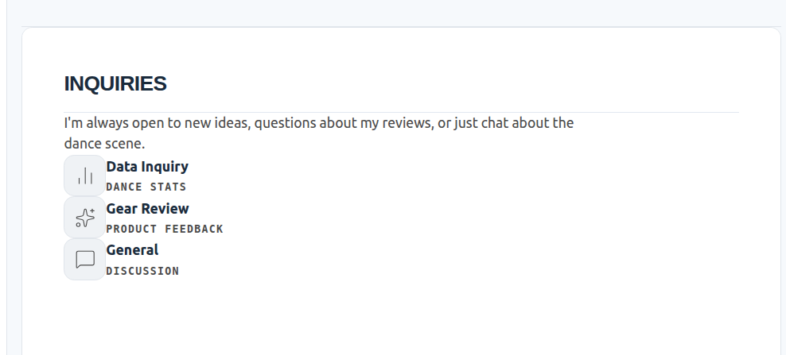
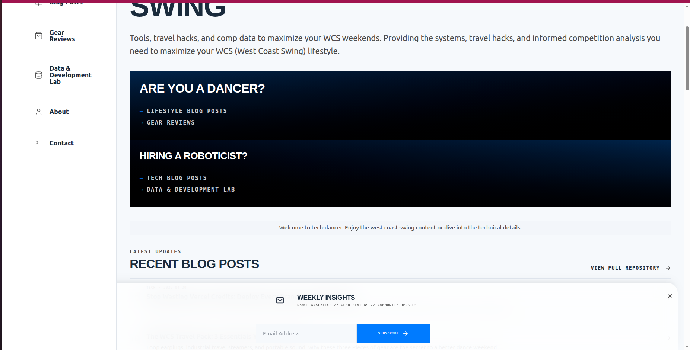
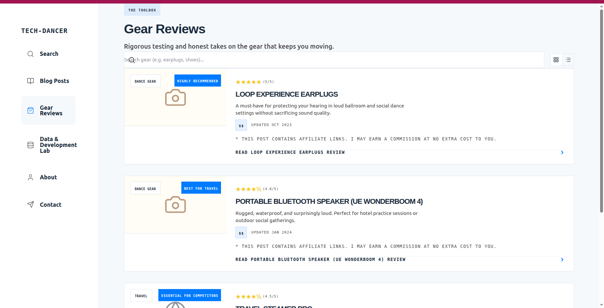
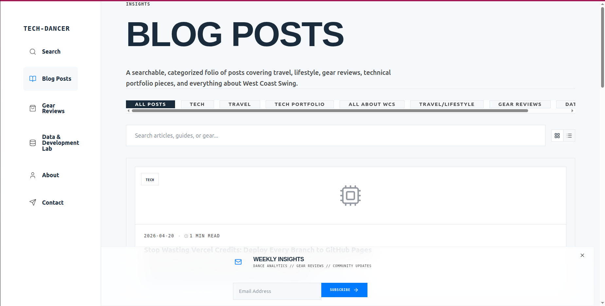
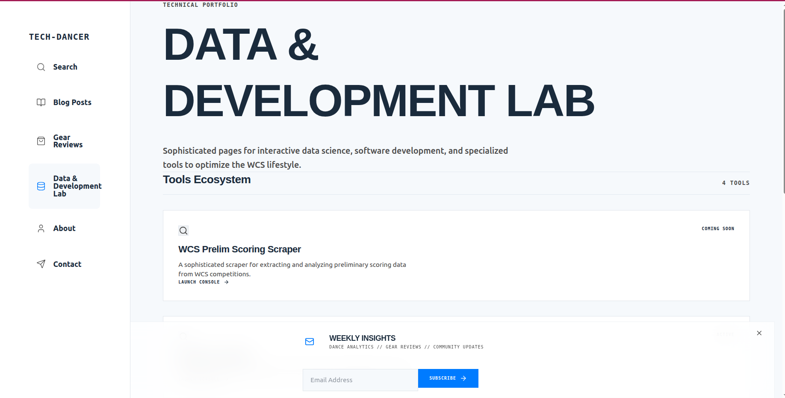
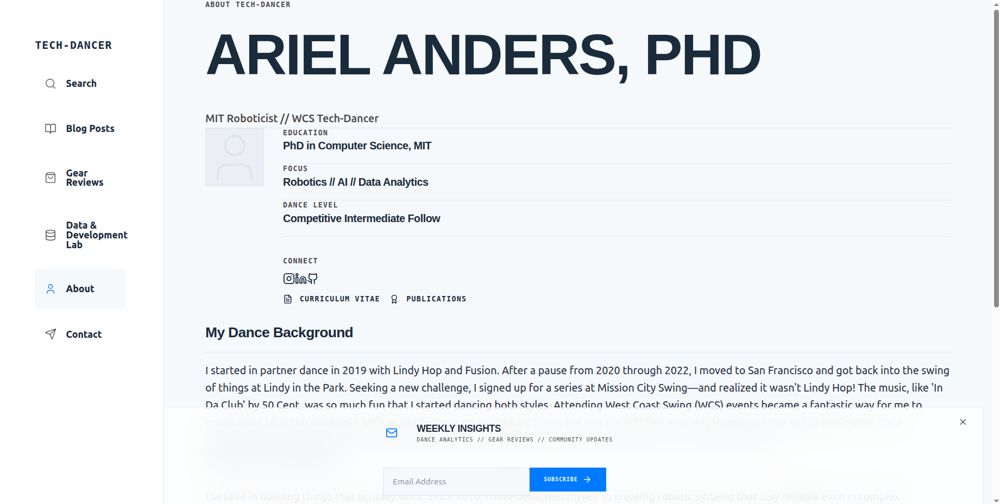
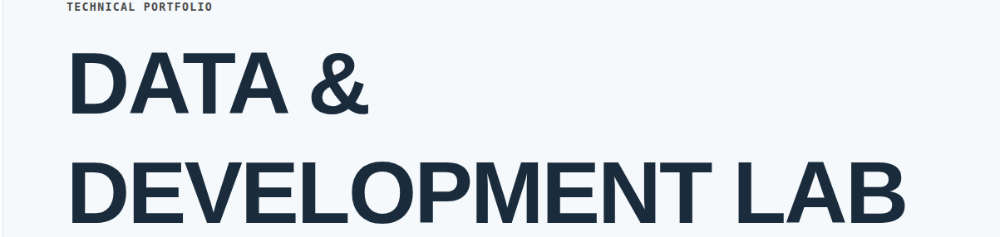

PR 215 -- REJECT gap between svg and icons is not fixed



PR 217 -- REJECT still vertical stacked



PR 218 -- Needs improvements
Gear reviews heading  is different from all other headings , , 
Need to address cramped top level description ":techincal portfiolio" followed by  massive heading  that eprsists on msot pagess


PR 222
Looking at both screenshots, there are three distinct layout bugs. Here are the targeted fixes:

---

## Bug 1: Score Bar — Items Clustered Right with Empty Left Space

The `ScoreGrid` uses a 5-column CSS grid but the grid container has no explicit width, so it shrinks to content width and gets pulled right. Also, 2 of 5 items show `—` (invisible), leaving dead columns.

**Fix in `src/components/layout/DetailElements.tsx`:**

```tsx
// REPLACE ScoreGrid entirely:
export function ScoreGrid({ children }: { children: React.ReactNode }) {
  return (
    <Box
      border="y"
      paddingY={6}
      surface="muted"
      className="border-line/50 w-full"
    >
      <Box className="flex flex-row w-full divide-x divide-line/30">
        {children}
      </Box>
    </Box>
  );
}

// REPLACE ScoreItem — remove the border-r class, use flex-1:
export function ScoreItem({ label, value, icon: Icon, color }: ScoreItemProps) {
  return (
    <Stack gap={1} align="center" className="flex-1 px-4 py-2">
      <Text variant="mono" size="tiny" color="dim" uppercase>{label}</Text>
      <Box display="flex" align="center" gap={1} className={color || ''}>
        {Icon && <Icon className="w-4 h-4" />}
        <Text variant="display" size="xl" weight="font-bold">{value}</Text>
      </Box>
    </Stack>
  );
}
```

---

## Bug 2: DURABILITY and VALUE Render as "—" (Invisible Dead Columns)

The data fields `durability` and `value` aren't set in the resource markdown files, so they silently occupy grid space. Guard them at the render site.

**Fix in `src/features/lab/components/GearPostDetail.tsx`:**

```tsx
const headerExtras = (
  <ScoreGrid>
    <ScoreItem label="Overall" value={post.rating ?? 'N/A'}
               icon={Star} color="text-yellow-500" />
    {post.durability && (
      <ScoreItem label="Durability"
                 value={`${post.durability}/5`} />
    )}
    {post.value && (
      <ScoreItem label="Value"
                 value={`${post.value}/5`} />
    )}
    <ScoreItem label="Price"
               value={post.priceCategory || '$$'}
               color="text-amber-600" />
    <ScoreItem label="Updated"
               value={post.updatedDate || post.date} />
  </ScoreGrid>
);
```

This means the bar will show 3 evenly-spaced items instead of 5 items with 2 invisible holes.

---

## Bug 3: Content Column Too Narrow on Desktop

The `DetailLayout` uses `maxWidth="5xl"` on the outer wrapper and then `Grid cols={{ base: 1, lg: 4 }}` for sidebar+content. The sidebar takes 1 column, content takes 3, but with `gap={12}` the reading column ends up around 500px.

**Fix in `src/components/layout/DetailLayout.tsx`:**

```tsx
// Change the outer container width:
// Before:
<Stack gap={12} maxWidth="5xl" marginX="auto" className="w-full">

// After:
<Stack gap={12} className="max-w-4xl mx-auto w-full">
```

```tsx
// Change the sidebar/content split from 4-col to 3-col:
// Before:
<Grid cols={{ base: 1, lg: sidebar ? 4 : 1 }} gap={12}>

// After:
<Grid cols={{ base: 1, lg: sidebar ? 3 : 1 }} gap={10}>
```

```tsx
// And update the content span to match:
// Before:
<Box className={sidebar ? "lg:col-span-3" : ""}>

// After:
<Box className={sidebar ? "lg:col-span-2" : ""}>
```

This gives sidebar 1 column and content 2 columns in a 3-col grid — roughly 33%/66% split, which at `max-w-4xl` (896px) gives a ~580px reading column.

---

## Bug 4: Title Shows ALL CAPS in Header Breadcrumb

The page-level breadcrumb `LOOP EXPERIENCE EARPLUGS` is uppercased because `typography.display` token includes `uppercase`. Fix the token so casing is opt-in.

**Fix in `src/styles/design-tokens.ts`:**

```ts
// Before:
display: "font-display font-bold uppercase tracking-tight leading-none",

// After:
display: "font-display font-bold tracking-tight leading-none",
```

Then add `uppercase` back explicitly only where short labels need it — category badges, `FilterBar`, `PageHeader` eyebrow label — not on full titles.

---

## Result

After these four fixes the gear review page should look like:

```
← BACK TO TOOLBOX
[DANCE GEAR]  · 1 MIN READ
Loop Experience Earplugs

┌──────────────────────────────────────────┐
│  OVERALL  │   PRICE   │    UPDATED       │  ← even flex row, full width
│   ★ 5     │   $$      │   Oct 2023       │
└──────────────────────────────────────────┘

 Sidebar (sticky)   │  Article content at readable width
 ─ Where to Buy     │  Why Dancers Need Hearing Protection
 ─ Affiliate link   │  Body text with comfortable line length...
```


------


