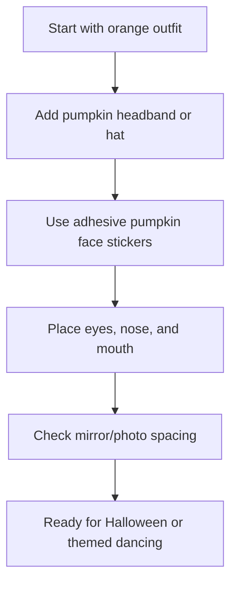

## Functional Theming

Halloween social dancing requires gear that doesn't restrict you.

### Easiest Version: Orange Outfit + Pumpkin Headband + Stickers

The fastest version of this costume does not require sewing or hand-cutting felt.

Use:
- An orange dress, shirt, jumpsuit, or matching set
- A pumpkin headband or small pumpkin hat
- Adhesive felt jack-o’-lantern face stickers

Put on the orange outfit first, then add the pumpkin headband. After that, use the adhesive felt stickers to create the jack-o’-lantern face directly on the outfit.

Start with the eyes, then add the nose, then place the mouth last. Keep the face large and simple so it reads well in photos, at parties, or on a social dance floor.

This is the easiest version because the headband creates the pumpkin silhouette, and the stickers replace the need to cut felt by hand.

### Helpful Supplies

- **Pumpkin headband / pumpkin hat:** A simple way to create the pumpkin silhouette instantly.
- **Adhesive pumpkin face stickers:** These pre-cut felt stickers save time and ensure a clean jack-o’-lantern look.

Disclosure: As an Amazon Associate, I may earn from qualifying purchases.

[Check out the Gear specific review here](/gear)
