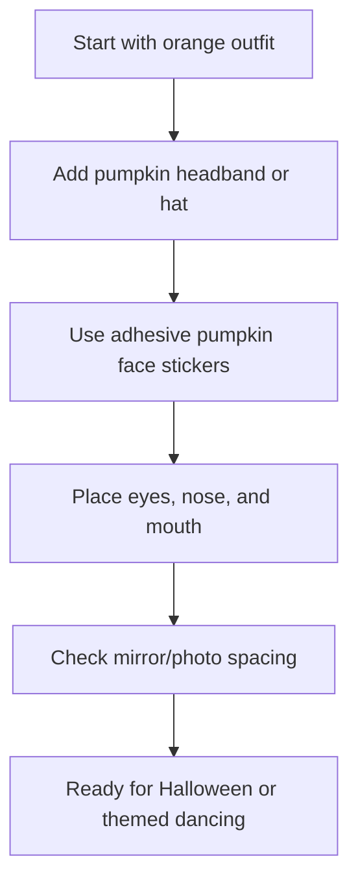

## Functional Theming for Halloween Social Dancing

Need a Halloween costume in two minutes? This is the easiest pumpkin costume: orange outfit, pumpkin headband, and stick-on jack-o’-lantern face.

This version is better for dancers because it feels more useful, easier to repeat, and directly supports comfortable movement on the floor. No bulky bodysuits or restrictive masks required.

## Easiest Version: Orange Outfit + Pumpkin Headband + Stickers

The fastest version of this costume does not require sewing or hand-cutting felt.

Use:

- An orange dress, shirt, jumpsuit, or matching set
- A pumpkin headband or small pumpkin hat
- Adhesive felt jack-o’-lantern face stickers

Put on the orange outfit first, then add the pumpkin headband. After that, use the adhesive felt stickers to create the jack-o’-lantern face directly on the outfit.

Start with the eyes, then add the nose, then place the mouth last. Keep the face large and simple so it reads well in photos, at parties, or on a social dance floor.

This is the easiest version because the headband creates the pumpkin silhouette, and the stickers replace the need to cut felt by hand. Done in 2 minutes 🎃

### Dance-Friendly Costume Checklist

- [x] **Breathable Fabric:** Choose an orange base that handles sweat well, like cotton or moisture-wicking tech wear.
- [x] **Secure Headband:** Use bobby pins if necessary to keep the hat/headband in place during high-speed spins.
- [x] **Sticker Security:** Press firmly on the felt stickers. For rib-knit or heavily textured fabrics, a tiny dab of fabric glue can provide extra insurance.
- [x] **Unrestricted Frame:** Ensure you can raise your arms into a dance frame without the outfit pulling or the stickers popping off.
- [x] **Clear Visibility:** Keeping the "face" on your torso ensures you don't have anything obstructing your vision while navigating a crowded social dance floor.

### Helpful Supplies

- **Pumpkin headband / pumpkin hat:** A lightweight way to create the pumpkin silhouette instantly without the bulk of a full costume.
- **Adhesive pumpkin face stickers:** Pre-cut felt stickers that save time and ensure a clean, recognizable jack-o’-lantern look.

Disclosure: As an Amazon Associate, I may earn from qualifying purchases.

[Check out the Gear specific review here](/gear)
