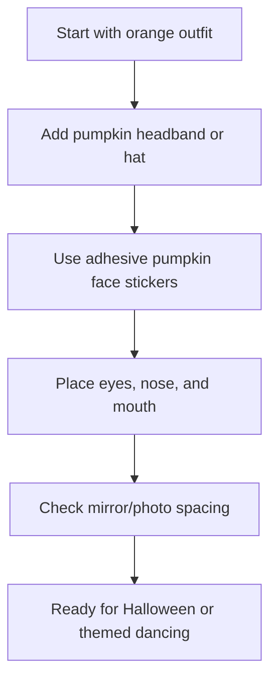

## Functional Theming

Halloween social dancing requires gear that doesn't restrict you.

<Notice type="info">
**Updated Video Concept**
**Title:** DIY Pumpkin Costume in 2 Minutes
**Core idea:** Orange outfit + pumpkin headband + adhesive jack-o’-lantern face stickers.
</Notice>

### Short Video Script

**Hook**
“Need a Halloween costume in two minutes? This is the easiest pumpkin costume: orange outfit, pumpkin headband, and stick-on jack-o’-lantern face.”

**Voiceover**
“Start with anything orange — a dress, shirt, jumpsuit, or matching set.
Then add a pumpkin headband or little pumpkin hat. That gives the costume shape right away, so you do not need to build a full costume from scratch.
For the face, use adhesive felt pumpkin stickers. These are easier than cutting felt by hand, and you can test the layout before committing.
Place the eyes first, then the nose, then the mouth. Keep the face big and simple so it reads clearly in photos or across a dance floor.
That’s it. Orange outfit, pumpkin hat, pumpkin face stickers. Cute, easy, and still comfortable enough to dance in.”

### Shot List
- **Shot 1 — Before:** Show the plain orange outfit. (On-screen text: “Last-minute pumpkin costume”)
- **Shot 2 — Add the Headband:** Put on the pumpkin headband / hat. (On-screen text: “Step 1: Add pumpkin headband”)
- **Shot 3 — Show Stickers:** Hold up the adhesive pumpkin face stickers. (On-screen text: “Step 2: Use stick-on pumpkin face”)
- **Shot 4 — Place the Face:** Apply or arrange the eyes, nose, and mouth on the orange outfit. (On-screen text: “No cutting felt required”)
- **Shot 5 — Final Look:** Mirror selfie / spin / dance step. (On-screen text: “Done in 2 minutes 🎃”)

## Easiest Version: Orange Outfit + Pumpkin Headband + Stickers

The fastest version of this costume does not require sewing or hand-cutting felt.

Use:
- An orange dress, shirt, jumpsuit, or matching set
- A pumpkin headband or small pumpkin hat
- Adhesive felt jack-o’-lantern face stickers

Put on the orange outfit first, then add the pumpkin headband. After that, use the adhesive felt stickers to create the jack-o’-lantern face directly on the outfit.

Start with the eyes, then add the nose, then place the mouth last. Keep the face large and simple so it reads well in photos, at parties, or on a social dance floor.

This is the easiest version because the headband creates the pumpkin silhouette, and the stickers replace the need to cut felt by hand.

### Helpful Supplies

- **Pumpkin headband / pumpkin hat:** Use the existing `pumpkin-headbands` affiliate item.
- **Adhesive pumpkin face stickers:** Add the Halloween adhesive felt sticker product as an optional shortcut.

Disclosure: As an Amazon Associate, I may earn from qualifying purchases.

[Check out the Gear specific review here](/gear)
