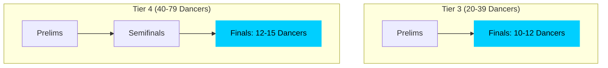
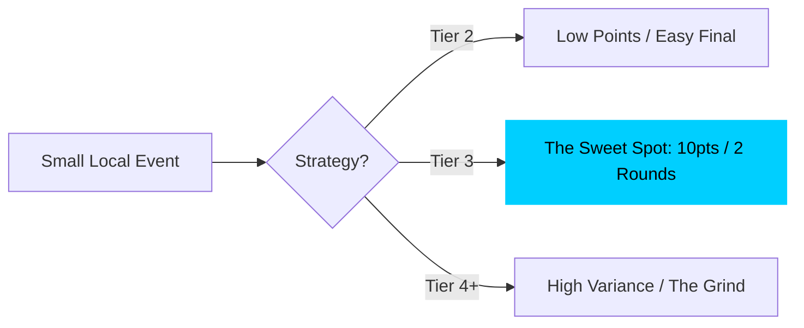

## The Reality of WCS Finals

In West Coast Swing, the margin between making a final and being the "first alternate" is razor-thin. But it's not just about how you dance; it's about the **math of the Tier system**.

The World Swing Dance Council (WSDC) defines Tiers based on the number of unique competitors. These Tiers determine both the points awarded and the number of rounds you must survive.

### The Competition Funnel: Survive the Rounds

As the number of competitors grows, so does the complexity of the tournament. The "survival math" changes dramatically once you hit Tier 4.

In a Tier 3 event, you only have to beat roughly 50-60% of the field once to make finals. In Tier 4, you have to beat the field in Prelims, and then beat a *filtered* field of semi-finalists just to get a chance to place.

### The "Tier 3 Sweet Spot"

For many dancers, Tier 3 is the "Sweet Spot." It offers the best ratio of points-potential to effort.

| Tier | Competitors | Rounds | Points for 1st | Points for 5th | Points for 10th |
| :--- | :--- | :--- | :--- | :--- | :--- |
| Tier 1 | 5-10 | 1 | 3 | 0 | 0 |
| Tier 2 | 11-19 | 1-2 | 6 | 1 | 0 |
| **Tier 3** | **20-39** | **2** | **10** | **2** | **1** |
| Tier 4 | 40-79 | 3 | 15 | 6 | 1 |
| Tier 5 | 80-129 | 3-4 | 20 | 10 | 2 |

**Why Tier 3 is better than Tier 4 for progress:**
1. **Fewer Rounds:** You only need to be "on" for two dances (Prelims and Finals). Tier 4 requires a Semifinal round, which adds fatigue and another opportunity for a bad draw or a single mistake to knock you out.
2. **Probability:** In Tier 3, with 20 dancers, 10 make finals. Your odds are 50%. In Tier 4, with 79 dancers, only 12-15 make finals. Your odds drop to ~18%.
3. **The Bubble:** Because the field is smaller, the "noise" of judging has less impact.

### Strategic Event Selection

If you are hunting for points to move up a division, bigger isn't always better. A massive Tier 5 event like *The Open* or *Wild Wild West* is a "grind" where even elite dancers can get stuck in the "Semis Bubble."

### Looking at the Big Picture

I'm building tools in the [DevAI Portfolio](/research) to normalize these results. By tracking whether you are consistently making Semis in Tier 4 or placing in Tier 3, we can see a much more reliable picture of your improvement than a single "No Recall" at a major event.

Don't let the math discourage you—let it inform your expectations. If you made the Semis at a Tier 4 event, you are likely an "above-average" dancer who just got caught in the survival math.
