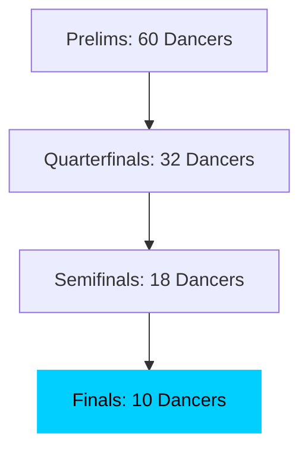
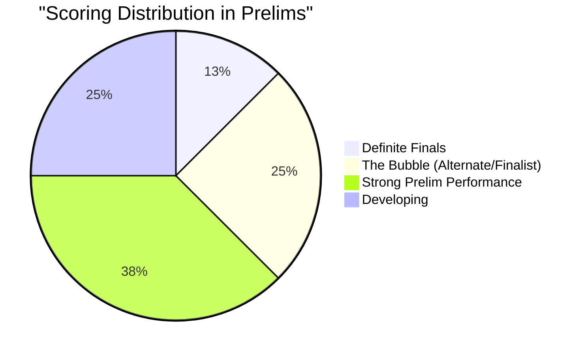

## The Reality of WCS Finals

In most West Coast Swing competitions, the margin between making a final and being the "first alternate" is razor-thin. When we look at the raw scores from events like the Jack & Jill O'Rama or Mission City Swing, we see a grouping of "above average" dancers who are often separated by a single judge's mark.

### How Results Vary

If there are 40 dancers in a heat and only 10 make the final, the 11th through 15th dancers are basically tied in many cases. Differences in judging, split-second focus shifts, and partner pairings all play a role in the final results.

This distribution highlights the "noise" inherent in subjective judging. While the top tier is often clear, the majority of competitive dancers occupy a space where a single judge's preference for musicality over footwork (or vice versa) can be the deciding factor between a callback and a seat in the audience.

### Looking at the Big Picture

I'm building tools in the [DevAI Portfolio](/research) to look at these results across multiple events. By tracking performance over time rather than just looking at one rank, we can see a much more reliable picture of improvement.

Don't let a "no-recall" define your weekend. Look at your dance videos.
