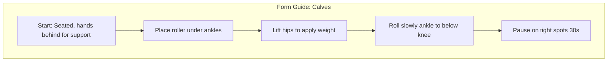
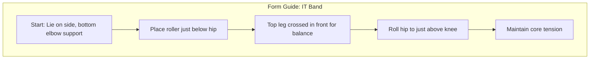
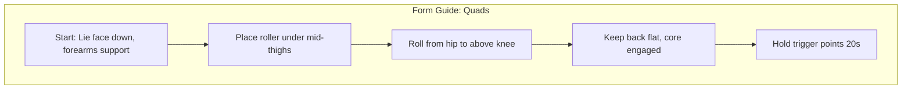
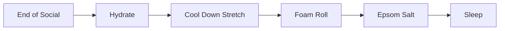

Recovery is just as important as practice. After a long weekend of dancing on hard ballroom floors, your muscles need targeted attention to prevent injury, reduce soreness, and maintain the flexibility required for high-level West Coast Swing.

### Muscle Recovery & Myofascial Release

A high-density foam roller is an essential tool for any dancer's home recovery kit. It uses your own body weight to perform deep tissue massage, breaking up adhesions in the fascia and increasing blood flow to tired tissues.

#### Targeted Foam-Rolling Techniques

For West Coast Swing dancers, the primary focus should be on the posterior chain and the muscles responsible for stabilization and explosive movement.

#### 1. Calves (Gastrocnemius & Soleus)

Dancers spend significant time on their toes. Place the roller under your ankles and slowly roll up toward the knee. To increase pressure, cross one leg over the other.

#### 2. IT Band

The Iliotibial band runs along the outside of the thigh. This is often a sensitive area for dancers due to the lateral movements in WCS. Lie on your side with the roller just below the hip and roll down to just above the knee.

#### 3. Quads

Lie face down with the roller under your thighs. Roll from the hips down to the tops of the knees. Focus on any "trigger points" or particularly tight spots by holding the position for 20-30 seconds.

<notice type="affiliate" id="foam-roller"></notice>

#### Percussive Therapy

While foam rolling is excellent for large muscle groups, percussive therapy offers a more targeted approach. A massage gun like the Hypervolt uses rapid, concentrated pulses to reach deep into muscle tissue, improving range of motion and accelerating recovery after intense social dancing.

<notice type="affiliate" id="hypervolt"></notice>

### The Post-Event Recovery Workflow

Consistency is key to effective recovery. Following a structured workflow after a social dance or a full event weekend can significantly reduce your post-event fatigue.

### Chemical Recovery: Hydration & Nutrition

During a convention, it's easy to fall into a cycle of caffeine and adrenaline. To recover properly, you must replenish electrolytes.

<notice type="affiliate" id="liquid-iv"></notice>

I recommend using a hydration multiplier like Liquid I.V. before bed and immediately upon waking. This helps combat the dehydration that leads to muscle cramping and the "swung over" feeling many dancers experience on Monday morning.

#### Hydration & Electrolytes

Water alone isn't always enough to recover from hours on the dance floor. Rehydration packets like Pedialyte are formulated with a precise balance of sugar and electrolytes to help you rehydrate faster than sports drinks or water alone, making them an essential part of your "Monday morning" recovery kit.

<notice type="affiliate" id="pedialyte"></notice>

### Soothing the Inflammation

Finally, never underestimate the power of a warm soak. Magnesium absorption through the skin can help relax muscles and improve sleep quality.

<notice type="affiliate" id="epsom-salt"></notice>

Add a generous amount of Epsom salts to a warm bath. The magnesium sulfate helps pull toxins from the muscles and reduces swelling in the feet and ankles—the true heroes of every dance weekend.
