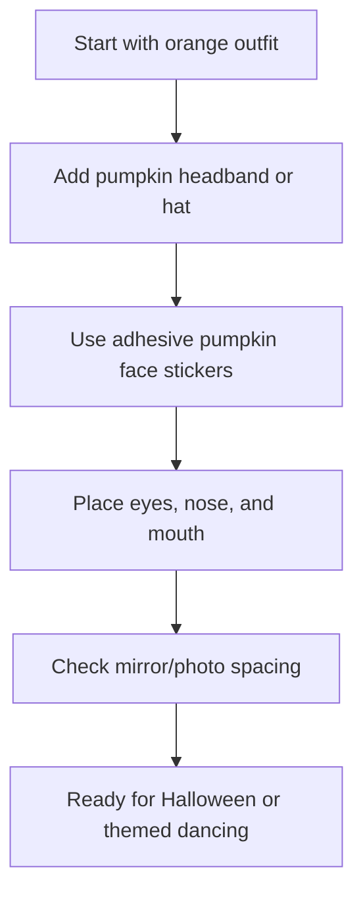

## Functional Theming for Halloween Social Dancing

Need a Halloween costume in two minutes? This is the easiest pumpkin costume: orange outfit, pumpkin headband, and stick-on jack-o’-lantern face.

This version is better for dancers because it feels more useful, easier to repeat, and directly supports comfortable movement on the floor. No bulky bodysuits or restrictive masks required.

## Easiest Version: Orange Outfit + Pumpkin Headband + Stickers

The fastest version of this costume does not require sewing or hand-cutting felt. By combining an existing orange outfit with a few key accessories, you can be ready for the dance floor in no time.

### What You Need

- **An orange outfit:** Start with anything orange — a dress, shirt, jumpsuit, or matching set.
- **Pumpkin headband or hat:** This gives the costume shape right away, so you do not need to build a full costume from scratch.
- **Adhesive jack-o’-lantern face stickers:** These are easier than cutting felt by hand, and you can test the layout before committing.

### How to Assemble

1. **Shot 1 — The Base:** Put on your plain orange outfit. Ensure it's something you can dance in for hours!
2. **Shot 2 — Add the Headband:** Put on the pumpkin headband or little pumpkin hat. This instantly creates the pumpkin silhouette.

3. **Shot 3 — Prep the Face:** Hold up the adhesive pumpkin face stickers to visualize the layout before sticking them on.

4. **Shot 4 — Place the Face:** Apply the eyes first, then the nose, then the mouth. Keep the face big and simple so it reads clearly in photos or across a dance floor.

5. **Shot 5 — Final Look:** Check your reflection, do a test spin, and you’re ready! Done in 2 minutes 🎃

### Dance-Friendly Costume Checklist

- [x] **Breathable Fabric:** Choose an orange base that handles sweat well, like cotton or moisture-wicking tech wear.
- [x] **Secure Headband:** Use bobby pins if necessary to keep the hat/headband in place during high-speed spins.
- [x] **Sticker Security:** Press firmly on the felt stickers. For rib-knit or heavily textured fabrics, a tiny dab of fabric glue can provide extra insurance.
- [x] **Unrestricted Frame:** Ensure you can raise your arms into a dance frame without the outfit pulling or the stickers popping off.
- [x] **Clear Visibility:** Keeping the "face" on your torso ensures you don't have anything obstructing your vision while navigating a crowded social dance floor.

### Helpful Supplies

- **Pumpkin headband / pumpkin hat:** A lightweight way to create the pumpkin silhouette instantly without the bulk of a full costume.
- **Adhesive pumpkin face stickers:** Pre-cut felt stickers that save time and ensure a clean, recognizable jack-o’-lantern look.

Disclosure: As an Amazon Associate, I may earn from qualifying purchases.

[Check out the Gear specific review here](/gear)
