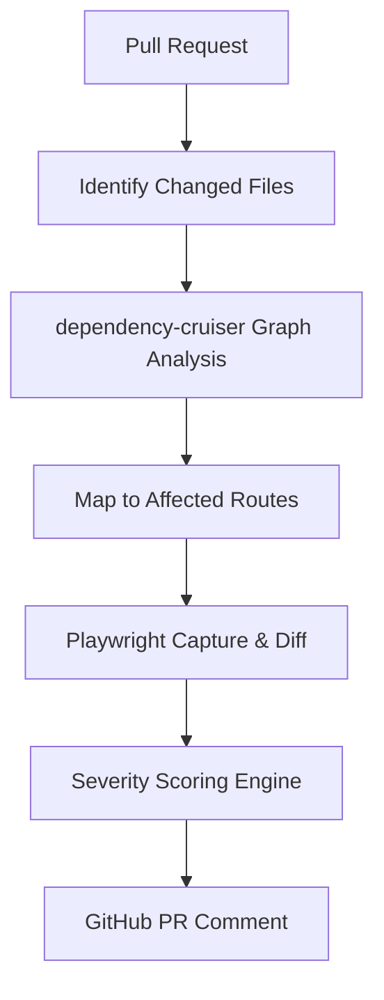

A common challenge in modern web development is understanding the "blast radius" of a change. When you modify a shared utility or a global CSS variable, how do you know which pages across your entire application are affected?

Manual regression testing is slow and error-prone. Full end-to-end suites are expensive to run on every commit. Our solution is the **Deployment Impact Analyzer**: a CI/CD pipeline that semantically determines the scope of a change and performs targeted visual validation.

## The Architecture

The Deployment Impact Analyzer operates in four distinct phases:

1.  **Import Graph Parsing**: Identifying which files are affected by the PR.
2.  **Route Mapping**: Translating affected files into user-facing routes.
3.  **Visual Diffing**: Capturing and comparing screenshots using Playwright and pixelmatch.
4.  **Severity Scoring**: Calculating the impact and reporting findings to the PR.



---

## 1. Import Graph Parsing with dependency-cruiser

We don't want to test every page if only the "About" section changed. To achieve targeted testing, we use `dependency-cruiser` to analyze the project's import graph.

When a file is modified, we trace its dependents up the tree until we reach an entry point (a route or a page component).

```bash
# Example logic for finding dependents
npx depcruise --exclude "^node_modules" --output-type json src | \
  jq '.modules[] | select(.dependencies[].resolved == "src/components/Button.tsx") | .source'
```

By identifying the "semantic blast radius," we reduce the number of screenshots we need to capture by up to 90% in large-scale applications.

---

## 2. Automated Playwright Screenshot Diffing

Once we have a list of affected routes, we trigger a Playwright-based capture service.

The pipeline performs a "sandwich" comparison:
1.  **Baseline**: Capture screenshots of the affected routes on the `main` branch.
2.  **Current**: Capture screenshots of the same routes on the feature branch.
3.  **Diff**: Use `pixelmatch` to generate a pixel-level delta.

To improve the signal-to-noise ratio, we automatically crop the diff to the bounding box of the changed area. This helps reviewers focus on the specific UI shift rather than scanning a full-page screenshot.

---

## 3. Severity Scoring & Reporting

Not all pixel diffs are created equal. A 1px shift in a footer is different from a broken hero section.

Our scoring engine calculates a **Severity Score** based on:
- **Pixel Count**: The absolute number of changed pixels.
- **Percentage**: The ratio of changed pixels to the total area.
- **Layout Shift**: Detection of significant element movement.

If the score exceeds a configurable threshold, the pipeline marks the check as failed and requests a manual visual review.

---

## 4. GitHub Actions Integration

The entire system is orchestrated via GitHub Actions. We've optimized the workflow to use caching for the `dependency-cruiser` graph and parallelize Playwright workers to keep execution times under 5 minutes.

```yaml
name: Deployment Impact Analysis
on: [pull_request]

jobs:
  impact:
    runs-on: ubuntu-latest
    steps:
      - uses: actions/checkout@v4
      - run: pnpm install
      - name: Run Impact Analysis
        run: pnpm run impact:analysis
      - name: Visual Diffing
        run: pnpm run impact:visual-diff
      - name: Post Report
        run: python scripts/send-jules-impact.py
```

### Example Report Output

When a PR is opened, the analyzer posts a summary directly to the GitHub conversation. This allows developers to see the impact at a glance without leaving their workflow.

| Route | Visual Diff | Severity | Action |
| :--- | :--- | :--- | :--- |
| `/blog/:slug` | 12.4% | 🔴 HIGH | Manual Review Required |
| `/about` | 0.0% | 🟢 LOW | Auto-passed |
| `/merch` | 1.2% | 🟡 MEDIUM | Review Suggested |

> **Implemented:** We use the `cropped` diff artifacts to show exactly where the pixels changed, saving reviewers from playing "spot the difference" on full-page screenshots.

### Real-World Finding: The "Invisible" Regression

In a recent PR, a developer modified a global spacing variable. On the surface, the changed files seemed unrelated to the landing page. However, the analyzer traced the dependency and flagged a **15% visual diff** on the Home route.

**The finding:**
- **Issue:** The navigation menu items shifted by 4px, causing the logo to wrap on smaller viewports.
- **Root Cause:** A Tailwind config change to the `gap-4` utility had unintended side effects on the header layout.
- **Resolution:** The developer adjusted the header to use a fixed pixel value, isolating it from the global spacing change.

Without the analyzer, this regression would likely have reached production, only to be discovered by a user on a mobile device.

## Lessons Learned

Building this tool taught us that **context is king**. An LLM can review code, but it struggles to "see" layout shifts. By combining deterministic graph analysis with visual regression, we create a "tripwire" that catches regressions before they reach production.

The next evolution of this tool involves agentic auto-resolution: using LLMs to analyze the visual diff and decide if a change is an intentional improvement or an accidental regression.

---

*This analyzer is part of the BoomTick.blog DevAI suite. Check out the [Engineering Portfolio](/research) for more tools.*
