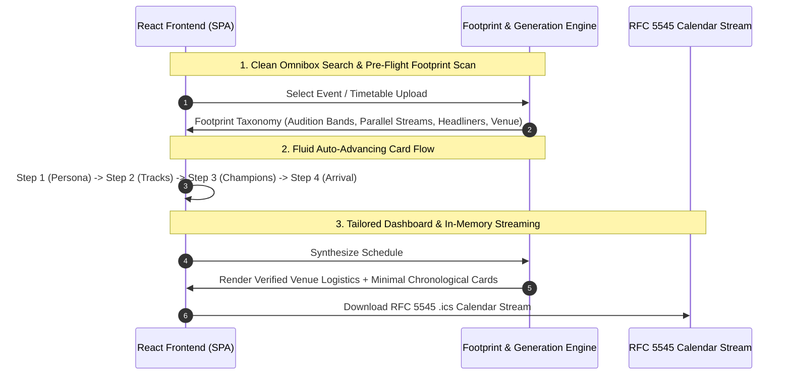

## Building a Stateless Multi-Modal Agent

When designing the WCS Navigator API, the primary engineering constraint was straightforward but demanding: the **Stateless In-Memory Guarantee**. We required zero database dependencies (no PostgreSQL, no Redis, no Firestore) and zero disk writes (no `/tmp` scratch files or filesystem container mounts). Every byte of data—from raw multi-page convention PDF schedules and URL scrapings to the generated RFC 5545 `.ics` calendar files—is ingested, processed, and streamed entirely within memory via standard HTTP request/response lifecycles.

To achieve production reliability and eliminate UX friction, we designed an intelligent four-stage pipeline:
1. **Search-First Omnibox Landing State**
2. **Pre-Flight Footprint Discovery Scan (`analyzeEventFootprint`)**
3. **Fluid Auto-Advancing Card Questionnaire**
4. **Tailored Schedule Dashboard with Event-Based Local Transit Logistics**

---

## 1. Pre-Flight Footprint Analysis (`questionGenerator.ts`)

Rather than presenting dancers with a generic or hardcoded survey, the agent evaluates the event timetable payload dynamically before generating questions:

```typescript
export function analyzeEventFootprint(
  eventName: string,
  discovery?: DiscoveryResponse
): DynamicQuestionStep[] {
  // 1. Evaluate Audition Tiers & Division prerequisite gates
  // 2. Isolate Parallel Workshop Track themes
  // 3. Extract Headlining Champion Instructors scheduled for the weekend
  // 4. Determine Host Venue Airport Transit conditions & touchdown targets
  return [personaStep, trackStep, instructorStep, arrivalStep];
}
```

This ensures that:
- **Audition Bands**: Events with auditions (e.g., *Boogie by the Bay Level 4/5*) ask for tier placement.
- **Parallel Tracks**: Classes are filtered by that weekend's distinct workshop streams (e.g., *Footwork & Connection*, *Musicality*, *Momentum Flow*).
- **Featured Champions**: Dancers select the headlining instructors they came to learn from (e.g., *Benji Schwimmer*, *Jordan & Tatiana*, *Kyle & Sarah*).

---

## 2. Fluid Auto-Advancing Card Questionnaire

To make the interaction feel fast and responsive:
- **Large Selection Cards**: Centered, balanced single-column layout (`max-w-xl mx-auto`) with distinct emoji badges, bold titles, and concise descriptions.
- **One-Click Auto-Advance**: Selecting any option highlights the card with a cyan glow and automatically advances to the next step after 180ms without requiring manual scrolling or a separate "Next" button.
- **Tactile Back Navigation**: A clean top-left `← Back` button allows dancers to re-evaluate prior choices.

---

## 3. Event-Based Local Transit & Venue Insight Card

Generic countdown mathematics often lack actionable clarity. WCS Navigator pairs the schedule with **verified host venue logistics**:

```typescript
const EVENT_LOGISTICS_MAP = {
  'boogie-by-the-bay': {
    venueName: 'Hyatt Regency San Francisco Airport (Burlingame, CA)',
    primaryAirport: 'SFO — 5 mins away',
    transitTip: 'Complimentary 24/7 Hyatt Airport Shuttle departs every 15-20 mins. No rental car needed.',
    baggageAndCheckin: 'Complimentary bell desk luggage holding prior to 3:00 PM check-in; 3rd-floor atrium connects directly to Grand Ballroom.',
    travelBuffer: 'Target SFO landing by 2:30 PM Friday for zero-rush ballroom check-in before evening workshops.'
  }
};
```

---

## 4. Ultra-Clean Minimalist Chronological Schedule

The final schedule view strips out unnecessary robot text, authenticity badges, and uppercase category subtitles in favor of clear, scannable session cards:
- **Session Cards**: Focused purely on Title, Time (`Clock`), and Ballroom Location (`MapPin`).
- **Usability Tools**: One-click `.ics` Apple/Google Calendar export and `.md` Markdown schedule download.

---

## 5. End-to-End Architecture Flow



By decoupling deterministic event data from flexible user preferences, WCS Navigator delivers frictionless, sub-second schedule optimization while honoring the strict stateless in-memory guarantee.
