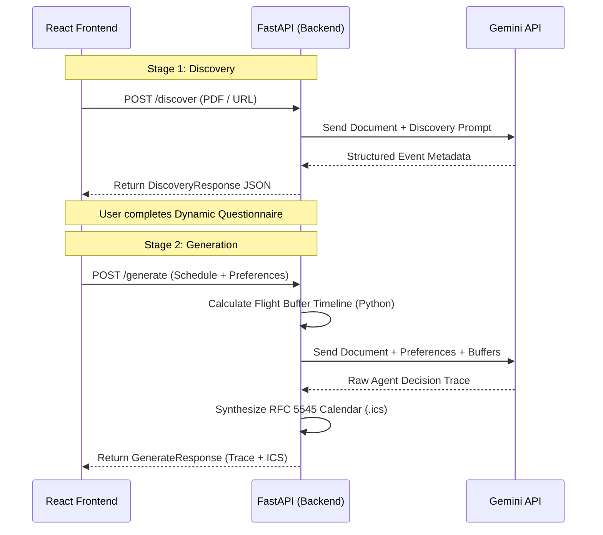

## Building a Stateless Multi-Modal Agent

When designing the WCS Navigator API, the primary constraint was straightforward but challenging: **Stateless In-Memory Guarantee**. We wanted zero database dependencies (no Postgres, no Firestore) and zero disk writes (no `/tmp` hacks). Every piece of data—from the user's uploaded convention schedule to the final customized calendar—must be processed and streamed entirely in-memory via HTTP.

To achieve this, we decoupled the agent into a strict two-stage pipeline using a Python FastAPI backend and the Gemini 2.5 Flash model.

## Two-Stage Architecture

The system operates in two distinct passes to ensure high reliability and context preservation without a persistent datastore.

### Stage 1: The Discovery Pass
The first stage receives the raw, multi-room convention schedule (either via PDF upload or URL). The FastAPI route (`/discover`) pipes this directly into the Gemini model.
The objective here is purely analytical:
- Parse the chaotic multi-room timetable.
- Identify competitive divisions, workshop levels, and late-night social themes.
- Extract a structured `DiscoveryResponse` containing the event metadata.

### Stage 2: The Generation Pass
Once the user reviews the discovered events and provides their preferences (e.g., transit time, warm-up buffers), the second stage (`/generate`) takes over.
- **Buffer Math:** The Python backend calculates critical backward buffers. For example, if a dancer's first competition call is at 7:00 PM, and they need 1.5 hours to settle into their hotel and 30 minutes of transit, the system computes the hard flight arrival deadline.
- **Agent Decision Trace:** The backend fuses the user's questionnaire, the computed buffer timeline, and the original schedule back into Gemini to generate the tailored `decision_trace`.
- **RFC 5545 Generation:** Finally, the backend synthesizes the final `.ics` calendar file in-memory, ready for instant download to Apple or Google Calendar.

## Architecture Diagram

Below is a visualization of the data flow across the React frontend, FastAPI backend, and the Gemini API.

By keeping the architecture strictly stateless and dividing the work between deterministic Python buffer math and flexible GenAI extraction, we created a lightweight, lightning-fast navigator that respecs both dancer time and server resources.
