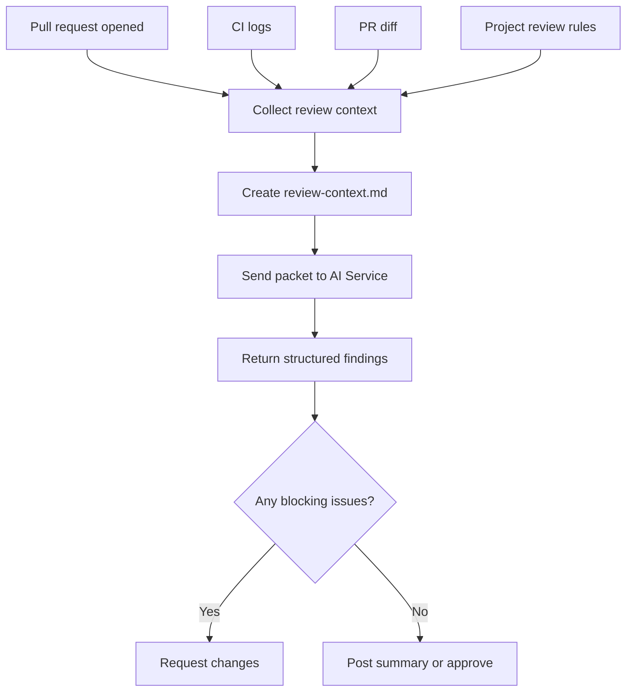
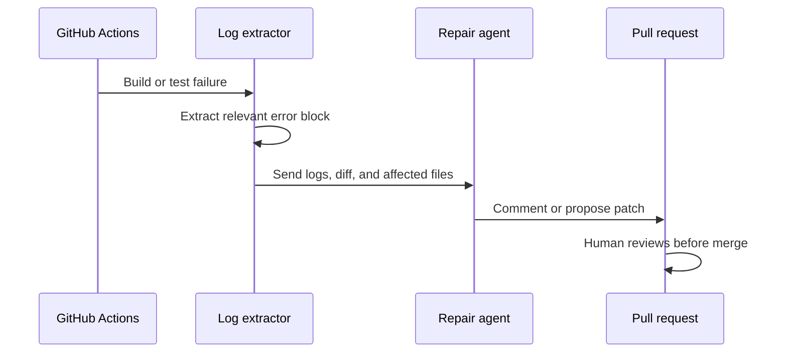

The first version of my AI review workflow made the classic mistake: I asked the model to do everything.

It had to understand the repo, inspect the diff, infer the design system, read CI logs, and decide what mattered. Sometimes it worked. Often it produced a confident wall of feedback that was hard to trust.

The better pattern was smaller and more boring: collect the important pull request context first, then ask the model to review that prepared packet.

This article walks through the hybrid review pipeline I use for BoomTick.blog: GitHub Actions collects the context, Gemini and GitHub Models review it, structured findings decide what blocks the PR, and Playwright screenshots catch UI changes that normal tests miss.

It is not a fully autonomous engineer. It is a review assistant made from scripts, prompts, CI glue, and a few hard safety boundaries.

## What you will build

By the end of this walkthrough, you will understand how to build a small hybrid review assistant that can:

- collect pull request context and perform token budgeting before calling an LLM
- send a focused prompt to Gemini or GitHub Models
- request structured findings instead of vague prose
- map findings into GitHub review states
- optionally use CI logs and Playwright screenshots as review inputs

This is not a replacement for human review. It is a way to make first-pass review more repeatable.

---

## The shape of the pipeline



The important part is not the exact command name. It is the handoff.

The model does not start with a vague instruction like "review this PR." It starts with a prepared packet: the diff, failing logs, linked context, and the project rules that matter for this repo.

That one change makes the review easier to repeat, easier to debug, and easier to distrust when it gets something wrong.

---

## What is real in this repo?

This article mixes two things:

- the workflow I actually use in this repo
- the general pattern someone else could copy

I call that out because AI automation articles often blur the line between "this works today" and "this would be cool if finished."

For this article:

- **Implemented** means the script, command, or workflow exists in the repo.
- **Experimental** means it exists but still needs manual setup, review, or judgment.
- **Pattern** means it is the architecture I recommend, even if the exact command name in your repo would be different.

---

## Command naming note

This article uses two kinds of commands:

- **Generic example commands** show the shape of the pipeline and are meant to be adapted.
- **Repo-specific commands** are the actual commands used in this project.

When a command is repo-specific, I call that out explicitly. When a command is generic, treat it as pseudocode for your own repo.

---

## 1. Make the model review a packet, not the repo

The biggest improvement came from taking work away from the model.

A weak review prompt looks like this:

> Review this PR.

That sounds simple, but it hides too many jobs. The model has to discover what changed, infer which files matter, understand the project conventions, notice CI failures, and decide which issues are worth blocking.

A better prompt starts with a prepared context packet.

That packet can include:

- the PR title and description
- the changed files
- the relevant diff
- CI failure logs
- linked issue text
- project-specific review rules
- design-system constraints

Now the model has a narrower job: review the packet and produce findings.

```bash
# Generic example: adjust command names to match your repo
python dev-tools/aggregate_pr_context.py \
  --target-branch main \
  --output .devai/review-context.md
```

> **Implemented:** `dev-tools/td-cli gh audit-pr <PR_NUMBER> --fetch` fetches PR diffs, CI logs, and linked issue context into a structured review packet. `dev-tools/aggregate-prs.sh` handles batch aggregation.

The point is not that my aggregation command is special. The point is that the model should receive a curated artifact instead of wandering through the repo.

---

## 2. Orchestrate with Hybrid AI Services

The AI part should be the least interesting part of the system. We use a hybrid approach, prioritizing **GitHub Models** (via the Azure inference endpoint) and **Gemini** (via Google Generative AI) for production reliability, with local models as a fallback.

The quality comes from everything around it: the context packet, the review rules, the output schema, and the script that decides what to do with the result.

```python
import os
import requests
from pathlib import Path

# GitHub Models (OpenAI-compatible)
GITHUB_MODELS_URL = "https://models.inference.ai.azure.com/chat/completions"
GITHUB_TOKEN = os.getenv("GITHUB_TOKEN")

context = Path(".devai/review-context.md").read_text()

prompt = f"""
You are reviewing a pull request.

Focus on:
1. correctness bugs
2. broken UI states
3. accessibility regressions
4. design-token violations
5. missing tests

Return:
- blocking issues
- non-blocking suggestions
- files to inspect manually

Context:
{context}
"""

response = requests.post(
    GITHUB_MODELS_URL,
    headers={
        "Authorization": f"Bearer {GITHUB_TOKEN}",
        "Content-Type": "application/json"
    },
    json={
        "model": "gpt-4o-mini",
        "messages": [{"role": "user", "content": prompt}],
        "stream": False,
    },
    timeout=120,
)

response.raise_for_status()
print(response.json()["choices"][0]["message"]["content"])
```

This is intentionally boring. If this part feels magical, the pipeline is probably too hard to debug. Using remote models provides higher consistency and allows us to use larger context windows when needed.

The model should not be responsible for knowing your repo's entire history. It should receive a bounded task, produce bounded output, and leave the final decision to deterministic code.

> **Implemented:** The AI orchestration logic (prioritizing GitHub Models and Gemini) is centralized in `dev-tools/utils.py`.

---

## 3. Ask for findings the code can understand

A paragraph of AI feedback is easy to read and hard to automate.

For a human-only workflow, prose is fine. For a CI workflow, prose is a problem. A script cannot reliably tell whether "this might be worth revisiting" should block a PR.

So I ask the model for structured findings.

```json
{
  "blocking": [
    {
      "file": "src/components/Nav.tsx",
      "reason": "Mobile menu button has no accessible label",
      "suggestion": "Add aria-label=\"Open navigation menu\""
    }
  ],
  "non_blocking": [
    {
      "file": "src/styles/tokens.ts",
      "reason": "Spacing token could be reused here"
    }
  ],
  "summary": "One blocking accessibility issue found."
}
```

The model can still be wrong. The schema does not make it truthful.

What the schema does is make the next step testable. A script can check whether `blocking` is empty. It can format comments consistently. It can refuse to request changes if the model returns malformed output.

---

## 4. Let scripts decide what blocks the PR

I do not want the model deciding whether a pull request is approved.

The model can describe findings. A deterministic script should decide how those findings map to GitHub review states.

That separation matters. It keeps the model from turning a stylistic opinion into a blocked PR, and it keeps a serious failure from being buried inside a friendly summary.

### Blocking

Use `REQUEST_CHANGES` when the finding should stop the merge: broken builds, accessibility regressions, missing required props, or known design-system violations.

### Non-blocking

Use `COMMENT` for feedback that may be useful but should not stop the PR: naming, refactors, minor cleanup, or subjective UI polish.

### Clean

Use `APPROVE` or a summary comment only when there are no blocking findings.

```python
# dev-tools/submit_review.py
import json

with open(".devai/review-result.json") as f:
    findings = json.load(f)

event = "REQUEST_CHANGES" if findings["blocking"] else "APPROVE"

pr.create_review(
    body=findings["summary"],
    comments=findings["blocking"] + findings["non_blocking"],
    event=event,
)
```

> **Implemented:** `dev-tools/submit_review.py` handles `APPROVE`, `REQUEST_CHANGES`, and `COMMENT` states.

The model proposes the facts. The script applies the policy.

---

## 5. Use CI failures as context, not permission to auto-merge

CI failures are useful because they are specific. They tell the agent where the pain is.

But a failing test should not give an agent permission to silently rewrite the project. The safer pattern is to treat the failure as context for a repair suggestion.

The workflow is:

1. CI fails.
2. A script extracts the relevant log section.
3. The repair agent receives the log, changed files, and recent diff.
4. The agent comments or proposes a patch.
5. A human reviews the result before merge.



That last step is not ceremony. It is the safety boundary.

> **Experimental:** `dev-tools/td-cli ai repair` can be triggered when CI fails. A GitHub Actions workflow (`jules-fix-trigger.yml`) exists to initiate repair sessions. Treat the output as a suggestion; always review before merge.

---

## 6. Use Playwright screenshots as a tripwire

For a UI-heavy site, "the tests pass" is not the same as "the page still looks right."

A layout can shift. A button can wrap. A mobile nav can cover the page. TypeScript will not care.

That is why I use Playwright screenshots as a tripwire. They do not decide whether a design change is good. They just tell me something changed.

```ts
import { test, expect } from "@playwright/test";

test("home page visual smoke test", async ({ page }) => {
  await page.goto("/");
  await expect(page).toHaveScreenshot("home-page.png", {
    fullPage: true,
  });
});
```

This works best for stable routes: home pages, article pages, navigation states, and important UI shells. It works poorly for pages with constantly changing content unless you mask or stabilize the dynamic areas.

> **Pattern:** Playwright visual regression is the architecture this repo is moving toward. The test runner config exists. Baseline screenshot generation and CI comparison are not yet fully automated; that is the next step.

---

## The smallest useful version

You do not need the whole pipeline to get value from this pattern.

The smallest useful version is just two steps:

1. Create a review context file.
2. Ask an AI model to review that file.

Everything else, including GitHub comments, review states, CI repair, and screenshot analysis, can come later.

```text
.devai/
  review-context.md
  review-result.json

dev-tools/
  aggregate_pr_context.py
```

```bash
# Generic example: file names are adaptable
python dev-tools/aggregate_pr_context.py > .devai/review-context.md
python dev-tools/ai_review.py .devai/review-context.md > .devai/review-result.json
python dev-tools/submit_review.py .devai/review-result.json
```

Even if you never post the result back to GitHub automatically, you still get something useful: a repeatable review artifact that can be inspected, improved, and rerun.

---

## What this does not solve

This pipeline makes review more repeatable. It does not make the model trustworthy.

Local models can still:

- hallucinate file paths
- miss subtle bugs
- over-focus on style
- misunderstand project conventions
- produce confident but invalid suggestions

That is why the model is boxed in on both sides.

Before the model, deterministic scripts collect the context. After the model, deterministic scripts decide how to handle the findings.

The model is useful, but it is not the source of truth.

---

## The lesson: shrink the model's job

The biggest improvement was not switching models. It was changing the shape of the task.

> Ask the model to inspect the repo, infer the architecture, find the diff, understand CI, and review the code.

That is the bad pattern. It produces feedback that is hard to trust and harder to automate.

> Give the model a prepared packet and ask it to perform one narrow review task.

That is the better pattern.

The more deterministic the pipeline is before and after the model call, the more useful the model becomes.

That is the pattern I would copy first: not the exact scripts, not the exact prompts, and not even the models. Start by shrinking the job.
