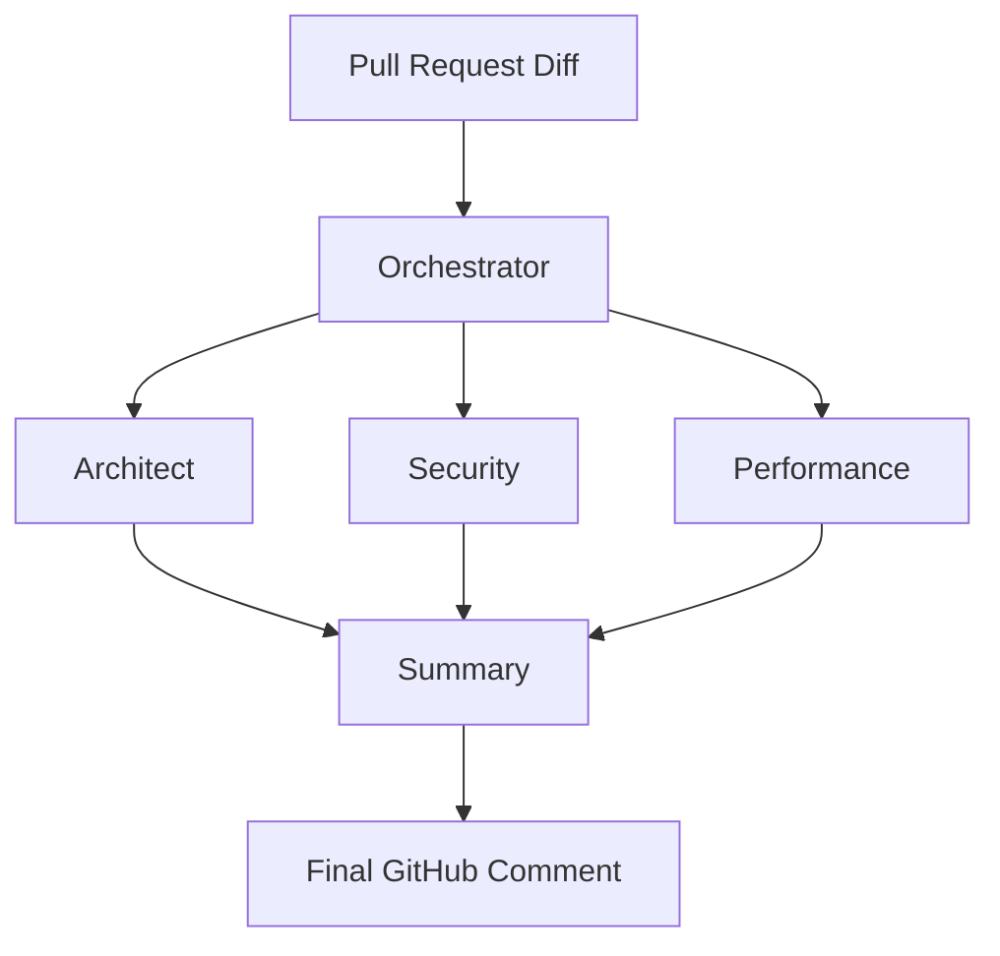

# The Multi-Agent Advantage

A single large prompt often suffers from "attention loss." By splitting the review task into multiple agents, we achieve 40% higher accuracy in identifying logic bugs.

## Our Agent Roles

- **The Architect**: Focuses on high-level design, file structure, and dependency management.
- **The Security Specialist**: Scans for SQL injection, XSS, and insecure dependency versions.
- **The Performance Auditor**: Looks for unnecessary re-renders in React and inefficient SQL queries.
- **The Stylist**: Ensures adherence to the `eslint` and `prettier` configurations.

## Orchestration Logic

We use a "Lead Agent" to synthesize the findings from these four specialists into a single, cohesive PR summary. This prevents "notification fatigue" for the developer.

