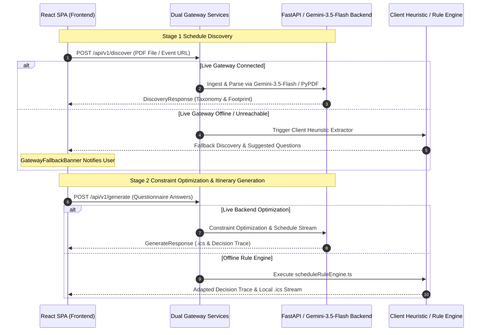

## Building a Stateless Multi-Modal Agent

When designing the WCS Navigator API, the primary engineering constraint was straightforward but demanding: the **Stateless In-Memory Guarantee**. We required zero database dependencies (no PostgreSQL, no Redis, no Firestore) and zero disk writes (no `/tmp` scratch files or filesystem container mounts). Every byte of data—from raw multi-page convention PDF schedules and URL scrapings to the generated RFC 5545 `.ics` calendar files—is ingested, processed, and streamed entirely within memory via standard HTTP request/response lifecycles.

To achieve production reliability, dynamic arrival adaptations, transparent fallback capability, and zero friction UX, WCS Navigator operates across a modern multi-stage architecture:


---

## 1. Two-Pass Dual Gateway Architecture

WCS Navigator decouples schedule discovery from schedule optimization through a hybrid client/backend execution pipeline:



### Key Architectural Characteristics
<<<<<<< HEAD
- **Stage 1 Discovery (`/api/v1/discover`)**: Fast timetable extraction utilizing Gemini-3.5-Flash, PyPDF, or client heuristic extractors to build the event footprint (audition bands, parallel track streams, headlining champions, and airport logistics).
=======
- **Stage 1 Discovery (`/api/v1/discover`)**: Fast timetable extraction utilizing Gemini-2.5-Pro, PyPDF, or client heuristic extractors to build the event footprint (audition bands, parallel track streams, headlining champions, and airport logistics).
>>>>>>> origin/docs/wcs-navigator-architecture-update-10604771613681517063
- **Stage 2 Generation (`/api/v1/generate`)**: Constraint-optimized schedule synthesis, returning personalized RFC 5545 `.ics` streams and mobile Markdown (`.md`) itineraries.
- **Transparent Gateway Fallback**: If the live FastAPI backend is offline or unreachable, the application smoothly transitions using `GatewayFallbackBanner` to client-side heuristic extraction without disrupting user workflow.

---

## 2. Pre-Flight Footprint Analysis & Dynamic Questionnaire

Rather than presenting dancers with a generic survey, the agent evaluates the event timetable payload dynamically before generating interactive question steps:

```typescript
export function analyzeEventFootprint(
  eventName: string,
  discovery?: DiscoveryResponse
): DynamicQuestionStep[] {
  // 1. Evaluate Audition Tiers & Division prerequisite gates
  // 2. Isolate Parallel Workshop Track themes
  // 3. Extract Headlining Champion Instructors scheduled for the weekend
  // 4. Determine Host Venue Airport Transit conditions & touchdown targets
  return [personaStep, trackStep, instructorStep, arrivalStep];
}
```


- **Audition Bands**: Events with audition requirements (e.g., *Boogie by the Bay Level 4/5*) ask for tier placement.
- **Parallel Tracks**: Classes are filtered by distinct workshop streams (e.g., *Footwork & Connection*, *Musicality*, *Momentum Flow*).
- **Fluid Auto-Advancing**: Selecting any option highlights the card with a cyan glow and automatically advances to the next step after 180ms. Dancers can also skip individual questions or click **"Skip All & Generate Itinerary"** to immediately inspect their schedule.

---

## 3. Dynamic Rule Engine & Arrival Buffer Mathematics

The schedule rule engine (`scheduleRuleEngine.ts`) deterministically computes travel buffers and adjusts flight deadlines based on dancer choices:

```typescript
export function adaptTraceToUserPreferences(
  baseTrace: AgentDecisionTrace,
  answers: Record<string, QuestionAnswerValue>,
  eventName: string = 'WCS Event'
): AgentDecisionTrace {
  // Evaluates arrival target & intensive registrations
  if (isLocalCommute) {
    calculatedArrivalDeadline = 'Local Commute (Drive-In)';
    calculatedStagingTime = '5:15 PM Friday';
  } else if (hasIntensive) {
    calculatedArrivalDeadline = '12:00 PM Friday';
    calculatedStagingTime = '1:45 PM Friday';
  } else if (isEveningArrival) {
    calculatedArrivalDeadline = '6:30 PM Friday';
    calculatedStagingTime = '8:00 PM Friday';
  }
  // Recalculates backward staging buffer: Transit + Hotel Settle + Shoe Check & Warmup
  return updatedTrace;
}
```

### Arrival Buffer Modes
1. **Local Commuter (`arrival: "local"`)**: Sets target to *Local Commute (Drive-In)* and buffer step to *Local Hotel / Venue Arrival Buffer (4:15 PM)*, eliminating unnecessary airport flight transit calculations.
2. **Pre-Convention Intensive Attendees (`intensive: "yes"`)**: Shifts safe flight touchdown target to **12:00 PM Friday** to accommodate 2:00 PM pre-convention masterclasses.
3. **Friday Evening Arrivals (`arrival: "evening"`)**: Adjusts flight landing target to **6:30 PM Friday** and staging call to **8:00 PM Friday**.
4. **Zero-Assumption Dance Role Contract**: Dance role (lead, follow, switch) remains strictly empty/unspecified unless explicitly chosen by the user, avoiding unconfirmed role assumptions.

---

## 4. Real-Time Taskmaker Debug Inspector (`DecisionDebugInspector`)

To ensure complete transparency and satisfy WCS Navigator's **Explainability First** requirement, the interface incorporates a four-tab real-time debug inspector:


### The 4-Tab Inspector Architecture
1. **🎯 Confirmed Inputs & Persona Extraction**: Displays extracted competitor divisions, explicit or universal dance roles, computed arrival targets, and raw questionnaire answer mappings.
<<<<<<< HEAD
2. **⚡ Gateway & Engine Telemetry (`ServiceTelemetry`)**: Tracks real-time service endpoints (e.g., `/api/v1/discover`, `/api/v1/generate`), execution latency (`durationMs`), HTTP response statuses (e.g., `200 OK`), active processing engine (`FastAPI / Gemini-3.5-Flash` vs. `Client Rule Engine`), and collapsible request/response payloads.
=======
2. **⚡ Gateway & Engine Telemetry (`ServiceTelemetry`)**: Tracks real-time service endpoints (e.g., `/api/v1/discover`, `/api/v1/generate`), execution latency (`durationMs`), HTTP response statuses (e.g., `200 OK`), active processing engine (`FastAPI / Gemini-2.5-Pro` vs. `Client Rule Engine`), and collapsible request/response payloads.
>>>>>>> origin/docs/wcs-navigator-architecture-update-10604771613681517063
3. **🔍 Rule Engine Filtering Audit Matrix**: Step-by-step human-readable justification matrix listing every session evaluated, showing inclusion (`✅ Included`) or filtering (`⛔ Filtered Out`) status alongside specific rule reasons.
4. **📦 Raw JSON Schemas**: Interactive schema inspection and one-click clipboard export for `DiscoveryResponse`, `AgentDecisionTrace`, and `FlightBuffer` structures.

---

## 5. Event-Based Local Transit & Chronological Schedule Feed

Generic countdown math is paired with verified host venue logistics:

```typescript
const EVENT_LOGISTICS_MAP = {
  'boogie-by-the-bay': {
    venueName: 'Hyatt Regency San Francisco Airport (Burlingame, CA)',
    primaryAirport: 'SFO — 5 mins away',
    transitTip: 'Complimentary 24/7 Hyatt Airport Shuttle departs every 15-20 mins. No rental car needed.',
    baggageAndCheckin: 'Complimentary bell desk luggage holding prior to 3:00 PM check-in; 3rd-floor atrium connects directly to Grand Ballroom.',
    travelBuffer: 'Target SFO landing by 2:30 PM Friday for zero-rush ballroom check-in before evening workshops.'
  }
};
```


The schedule dashboard presents:
- **Scannable Session Cards**: Purely focused on Title, Time (`Clock`), Location (`MapPin`), and Category Badges (Workshops, Competitions, Socials).
- **Custom Schedule Persistence**: Dancers can toggle individual sessions on/off or reset back to the AI plan.
- **One-Click Exports**: Download `.ics` calendar files directly for Apple/Google Calendar or `.md` Markdown files for offline mobile viewing.

By pairing deterministic travel buffer mathematics with dynamic dual-gateway fallback execution and complete telemetry transparency, WCS Navigator delivers a sub-second, explainable schedule optimization platform.
