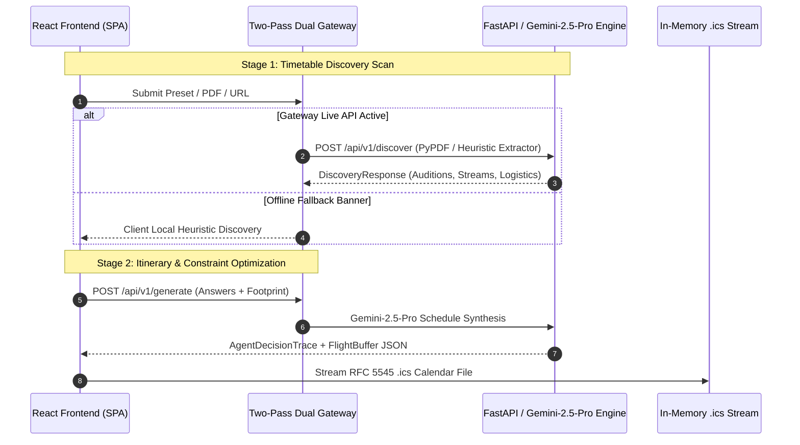

## Building a Stateless Multi-Modal Agent

When designing the WCS Navigator API, the primary engineering constraint was straightforward but demanding: the **Stateless In-Memory Guarantee**. We required zero database dependencies (no PostgreSQL, no Redis, no Firestore) and zero disk writes (no `/tmp` scratch files or filesystem container mounts). Every byte of data—from raw multi-page convention PDF schedules and URL scrapings to the generated RFC 5545 `.ics` calendar files—is ingested, processed, and streamed entirely within memory via standard HTTP request/response lifecycles.

To achieve production reliability and eliminate UX friction, we designed an intelligent four-stage pipeline:
1. **Search-First Omnibox Landing State & Ingestion Dropzone**
2. **Pre-Flight Footprint Discovery Scan & Auto-Advancing Card Questionnaire**
3. **Two-Pass Dual Gateway & Dynamic Arrival Buffer Engine**
4. **Real-Time Taskmaker Debug Inspector & Tailored Itinerary Dashboard**

---

## 1. Search-First Omnibox & Multi-Modal Ingestion

The entry point of WCS Navigator features a Google Search-style omnibox paired with a pre-indexed taxonomy of California 2026 conventions (*Boogie by the Bay*, *South Bay Dance Fling*, *Halloween SwingThing*, *The Open*, *The After Party*). In addition to pre-indexed events, dancers can toggle the custom ingestion drawer to drop raw schedule PDFs or input live schedule URLs.


---

## 2. Pre-Flight Footprint Analysis & Questionnaire (`questionGenerator.ts`)

Rather than presenting dancers with a generic or hardcoded survey, the agent evaluates the event timetable payload dynamically before generating questions:

```typescript
export function analyzeEventFootprint(
  eventName: string,
  discovery?: DiscoveryResponse
): DynamicQuestionStep[] {
  // 1. Evaluate Audition Tiers & Division prerequisite gates
  // 2. Isolate Parallel Workshop Track streams
  // 3. Extract Headlining Champion Instructors scheduled for the weekend
  // 4. Determine Host Venue Airport Transit conditions & touchdown targets
  return [personaStep, trackStep, instructorStep, arrivalStep];
}
```

Dancers navigate single-column selection cards with emoji badges and one-click auto-advance:


- **Audition Bands**: Events with audition gates (e.g., *Boogie Level 4/5*) ask for tier placement.
- **Parallel Tracks**: Classes are filtered by that weekend's distinct workshop streams (e.g., *Footwork & Connection*, *Musicality*, *Momentum Flow*).
- **Featured Champions**: Dancers select headlining instructors (e.g., *Benji Schwimmer*, *Jordan & Tatiana*, *Kyle & Sarah*).

---

## 3. Dynamic Rule Engine & Arrival Buffer Mathematics (`scheduleRuleEngine.ts`)

A central pillar of WCS Navigator's schedule optimization is its backward flight buffer formula. Rather than guessing arrival deadlines, `scheduleRuleEngine.ts` calculates touchdown deadlines backward from the dancer's earliest contest staging call or class commitment.

### Arrival Mode Adaptations

1. **Local Commuter (`arrival: "local"`)**:
   - Replaces airport flight transit calculations with local commute drive-in logistics.
   - Sets target arrival deadline to **Local Commute (Drive-In)** and adjusts buffer step to **Local Hotel / Venue Arrival Buffer (4:15 PM)**.
2. **Intensive Attendees (`intensive: "yes"`)**:
   - Detects pre-convention Friday masterclasses (starting at 2:00 PM).
   - Shifts target flight touchdown deadline backward to **12:00 PM Friday** to ensure hotel check-in and room entry before 1:45 PM staging.
3. **Evening Arrivals (`arrival: "evening"`)**:
   - Adjusts landing target to **6:30 PM Friday** for late-night social kickoff and evening workshops.

### Zero-Assumption Contract

WCS Navigator operates under a strict **Zero-Assumption Contract**: dancer roles (Lead, Follow, Switch) remain unconstrained (`""` / `undefined`) unless explicitly selected by the dancer. This prevents filtering out universal classes or misclassifying dancers who compete in dual roles.

---

## 4. Two-Pass Dual Gateway Architecture

WCS Navigator relies on a hybrid execution pipeline that balances high-speed client heuristics with powerful backend generative model capabilities:



- **Stage 1 Discovery**: Extracts raw timetable structures, audition levels, parallel room tracks, and instructor schedules using Gemini-2.5-Pro, PyPDF, or local heuristic fallback.
- **Stage 2 Generation**: Performs constraint optimization against questionnaire responses, outputting formatted markdown itineraries and streaming RFC 5545 `.ics` files.
- **Transparent Fallback**: When backend services are unreachable or running without API keys, `GatewayFallbackBanner` seamlessly degrades to client-side rule evaluation without interrupting the dancer's session.

---

## 5. Taskmaker Debug Inspector & Telemetry Architecture (`DecisionDebugInspector`)

To satisfy our **Explainability First** design mandate, WCS Navigator embeds an interactive 4-tab debug inspector (`DecisionDebugInspector`) directly within the schedule dashboard.


### The 4-Tab Inspector Breakdown

1. **🎯 1. Confirmed Inputs & Persona Extraction**:
   - Displays dynamic mapping of confirmed questionnaire answers (`workshop_level`, `competition_divisions`, `arrival: "local"`) to extracted personas without unconfirmed role assumptions.
2. **⚡ 2. Gateway & Engine Telemetry (`ServiceTelemetry`)**:
   - Tracks real-time service endpoints (`/api/v1/discover`, `/api/v1/generate`), execution latency (`durationMs`), HTTP response status codes, and active processing engines (FastAPI / Gemini-2.5-Pro vs Client Schedule Rule Engine).
3. **🔍 3. Rule Engine Filtering Audit**:
   - Presents a human-readable justification matrix detailing exactly why each workshop or contest call was marked `Included` or `Filtered Out` (e.g., *"Filtered out because Social Dancer persona was selected (no contest calls)"*).
4. **📦 4. Raw JSON Schemas**:
   - Provides full interactive schema inspection and one-click clipboard export for `DiscoveryResponse`, `AgentDecisionTrace`, and `FlightBuffer` contracts.

---

## 6. Unified Chronological Schedule Feed & Logistics

The final itinerary feed consolidates travel logistics, venue insights, day-by-day workshops, and theme party dress codes into a single scannable dashboard:


- **Venue Logistics**: Pairs schedule cards with verified host hotel details (e.g., Hyatt Regency Burlingame 24/7 airport shuttle details).
- **One-Click Exports**: One-click RFC 5545 `.ics` export for Apple/Google Calendar and `.md` Markdown itinerary download for offline mobile access.
