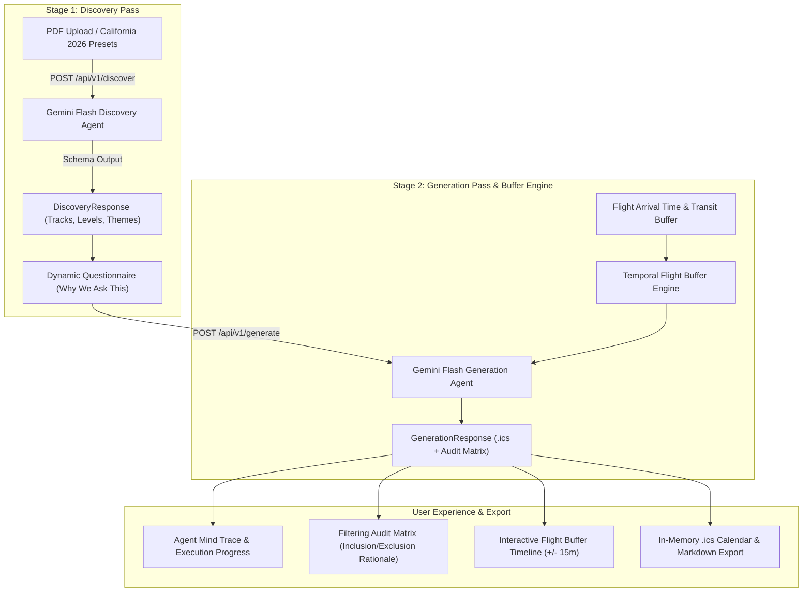

# WCS Navigator: Comprehensive System Requirements & Technical Specification

**Project:** WCS Navigator (West Coast Swing Event Schedule & Travel Optimizer)  
**System Scope:** Standalone Intelligent Two-Pass Agentic Scheduling Service  
**Architecture:** React 19 Frontend + FastAPI Backend (Google Cloud Run / Gemini Flash)  
**Decoupling Notice:** This specification is strictly dedicated to WCS Navigator and operates independently of any external scraping systems.

---

## 🎯 1. System Overview & Problem Statement

Dance conventions (e.g., *Boogie by the Bay*, *Halloween SwingThing*, *Swingtacular*, *Wild Wild Westie*, *JJO*) publish dense, multi-page visual PDF schedules. Attendees and competitors face several key challenges:
1. **Multi-Track Overload**: Overlapping workshop tiers (Level 1–5 / Novice–All-Star), competition preliminary rounds, leveled intensives, dinner breaks, and late-night social dancing (frequently running until 5:00 AM).
2. **Flight Staging Anxiety**: Arriving too late on Friday to settle into the hotel, warm up, and check in for competition preliminary staging calls.
3. **Black-Box Confusion**: Not knowing which workshops require auditions or specific division prerequisites.

**WCS Navigator** solves this through a **zero-storage, stateless, two-pass agentic loop** that scans unstructured convention schedules, dynamically configures personalized questionnaires, performs temporal buffer calculations, and streams transparent, tailored schedules in `.ics` and Markdown formats.



---

## 📋 2. Functional Requirements (FR)

### FR-1: Two-Pass Intelligent Workflow
- **FR-1.1 (Discovery Pass)**:
  - Ingest PDF schedule bytes or preset event configurations.
  - Automatically detect tracks (e.g., *West Coast Swing*, *Solo Jazz*, *Country Swing*), leveled workshop systems (e.g., *Level 1–5*, *Audition Only*), competition preliminary staging windows, and nightly theme dress codes.
  - Dynamically construct a structured `DiscoveryResponse` payload to configure frontend questions.
- **FR-1.2 (Generation Pass)**:
  - Compile the dancer's questionnaire responses, skill level, and flight buffer constraints.
  - Generate an individualized `.ics` calendar payload alongside an explainable decision trace.

### FR-2: Temporal Flight Buffer Engine
- **FR-2.1 (Deadline Formulation)**:
  - Given the dancer's earliest mandatory competition staging or workshop time $T_{\text{staging}}$, calculate the latest safe flight landing time:
    $$T_{\text{landing\_deadline}} = T_{\text{staging}} - (T_{\text{transit}} + T_{\text{hotel\_settle}} + T_{\text{warmup}})$$
- **FR-2.2 (Interactive Delta Adjustment)**:
  - Provide client-side interactive buffer stepper controls ($\pm 15$ minutes) that dynamically recalculate and filter Friday/Sunday schedule items in real time without requiring server round-trips.

### FR-3: Explainable Decision Trace & Audit Matrix
- **FR-3.1 (P0 Question Explainability)**:
  - Every dynamic question must render an expandable *"Why We Ask This"* trigger detailing Gemini Flash's decision logic and rule grounding.
- **FR-3.2 (Session Classification & Filtering Audit)**:
  - Categorize every schedule item into `all`, `included`, and `filtered`.
  - For filtered sessions, explicitly display the exclusion reason (e.g., *"Excluded: Out of skill level"* or *"Excluded: Flight arrives at 4:30 PM, staging is at 4:00 PM"*).

### FR-4: Multi-Format Schedule Export
- **FR-4.1 (iCalendar / .ics)**:
  - Generate valid RFC 5545 `.ics` strings in-memory containing event alarms, room locations, descriptions, and dress code tags.
- **FR-4.2 (Markdown Schedule Export)**:
  - One-click export and clipboard copy of a structured Markdown schedule table.
- **FR-4.3 (Download Toast Notification)**:
  - Instant visual feedback with dismissible toast confirmation upon triggering calendar or markdown downloads.

### FR-5: California 2026 Golden Presets & Offline Fallback
- **FR-5.1 (Instant Preset Hydration)**:
  - Provide pre-extracted golden fixtures for major California 2026 events (*Boogie by the Bay*, *Halloween SwingThing*, *Swingtacular*, *Wild Wild Westie*, *JJO*).
- **FR-5.2 (Offline Resilience)**:
  - Fall back seamlessly to local fixtures when the backend is unreachable, ensuring 100% frontend uptime.

---

## 🛡️ 3. Non-Functional Requirements (NFR)

### NFR-1: Zero-Storage & Privacy
- **Stateless Architecture**: No dancer schedules, questionnaire answers, flight details, or generated `.ics` files are saved to disks or databases. All computations happen in-memory.

### NFR-2: Performance & Frame Budget
- **Discovery Pass Latency**: $\le 3.0$ seconds for full PDF parsing via Gemini Flash.
- **Generation Pass Latency**: $\le 3.0$ seconds for complete `.ics` and audit matrix compilation.
- **Frontend Responsiveness**: 60 fps interactions during flight buffer adjustments ($< 16\text{ms}$ recalculation latency).

### NFR-3: Design System & Accessibility
- **Primitive Components**: 100% compliance with repository design primitives (`Box`, `Stack`, `Text`, `Grid`) and zero inline styles.
- **Accessibility (WCAG 2.1 AA)**: Minimum $44\text{px} \times 44\text{px}$ interactive tap targets (`minHeight="11"`), full keyboard navigation, and visible focus rings.

---

## 🏛️ 4. API Specification & Data Contracts

### 4.1 Discovery Endpoint: `POST /api/v1/discover`
- **Request**: Multipart form data with `file: UploadFile` or JSON `{ "event_url": string }`.
- **Response Schema (`DiscoveryResponse`)**:
```json
{
  "preset_id": "boogie_by_the_bay",
  "preset_name": "Boogie by the Bay 2026",
  "event_name": "Boogie by the Bay 2026",
  "tracks_detected": ["West Coast Swing", "Strictly Swing", "Classic / Showcase"],
  "leveled_workshops_detected": {
    "has_leveled_workshops": true,
    "detected_levels": ["Novice", "Intermediate", "Advanced", "All-Star"],
    "recommendation": "WSDC points required for Level 3+ workshops"
  },
  "social_themes_detected": [
    { "night": "Friday Night", "theme": "Neon / Glow Party" },
    { "night": "Saturday Night", "theme": "Black Tie Gala" }
  ],
  "questions": [
    {
      "id": "skill_level",
      "label": "What is your primary WCS competition division?",
      "type": "select",
      "options": ["Newcomer", "Novice", "Intermediate", "Advanced", "All-Star"],
      "why_we_ask_this": "Used to filter leveled workshop tracks and competition staging times."
    }
  ]
}
```

### 4.2 Generation Endpoint: `POST /api/v1/generate`
- **Request Schema (`GenerationRequest`)**:
```json
{
  "event_id": "boogie_by_the_bay",
  "answers": {
    "skill_level": "intermediate",
    "competitions": ["Jack & Jill", "Strictly Swing"],
    "flight_arrival": "2026-10-09T14:30:00"
  },
  "buffer_preferences": {
    "transit_minutes": 30,
    "hotel_settle_minutes": 90,
    "warmup_minutes": 60
  }
}
```

- **Response Schema (`GenerationResponse`)**:
```json
{
  "event_name": "Boogie by the Bay 2026",
  "ics_content": "BEGIN:VCALENDAR\nVERSION:2.0\n...",
  "decision_trace": {
    "summary": "Optimized schedule for Intermediate competitor arriving Friday 2:30 PM.",
    "flight_buffer": {
      "earliestStagingTime": "5:15 PM (Friday)",
      "warmupMinutes": 60,
      "hotelSettleMinutes": 90,
      "transitMinutes": 30,
      "latestFlightArrivalDeadline": "2:15 PM (Friday)",
      "formulaSummary": "Flight Landing (2:15 PM) + 30m Transit + 90m Settle + 60m Warmup = 5:15 PM Staging"
    },
    "sessions": [
      {
        "id": "session-1",
        "title": "Intermediate WCS Footwork Intensive",
        "time": "4:00 PM - 5:00 PM (Friday)",
        "location": "Grand Ballroom",
        "category": "workshop",
        "is_included": true,
        "fit_reason": "Matches your selected Intermediate skill level."
      }
    ],
    "sub_tasks": [
      { "id": "1", "label": "Schedule Parsed", "status": "completed" },
      { "id": "2", "label": "Divisions Filtered", "status": "completed" },
      { "id": "3", "label": "Travel Buffer Calculated", "status": "completed" },
      { "id": "4", "label": "Calendar Generated (.ics)", "status": "completed" }
    ],
    "themes": [
      { "id": "t1", "day": "Friday Night", "themeTitle": "Neon Glow", "dressCode": "Fluorescent / UV Reactive", "packingTip": "Bring glow accessories" }
    ]
  }
}
```

---

## 🗺️ 5. Next-Phase Execution Milestones

```
Milestone 1: Backend Testing & API Gateway Connection
├── [Issue #4360] Unit test coverage for wcs_navigator_api (buffer_engine.py & pdf_service.py)
├── Configure VITE_WCS_NAVIGATOR_API_URL environment variable handling
└── Implement live Cloud Run invocation with fallback to golden fixtures

Milestone 2: Arbitrary PDF Upload Pipeline
├── Connect DropzoneUpload.tsx to POST /api/v1/discover
└── Implement progress loading indicators and error boundary handling

Milestone 3: Visual Timeline & Interactive Schedule Grid
├── Multi-day visual grid view (Friday / Saturday / Sunday columns)
├── Color-coded category tags (Workshops, Prelims, Finals, Socials, Buffers)
└── Webcal / Apple Calendar live subscription link generation
```
