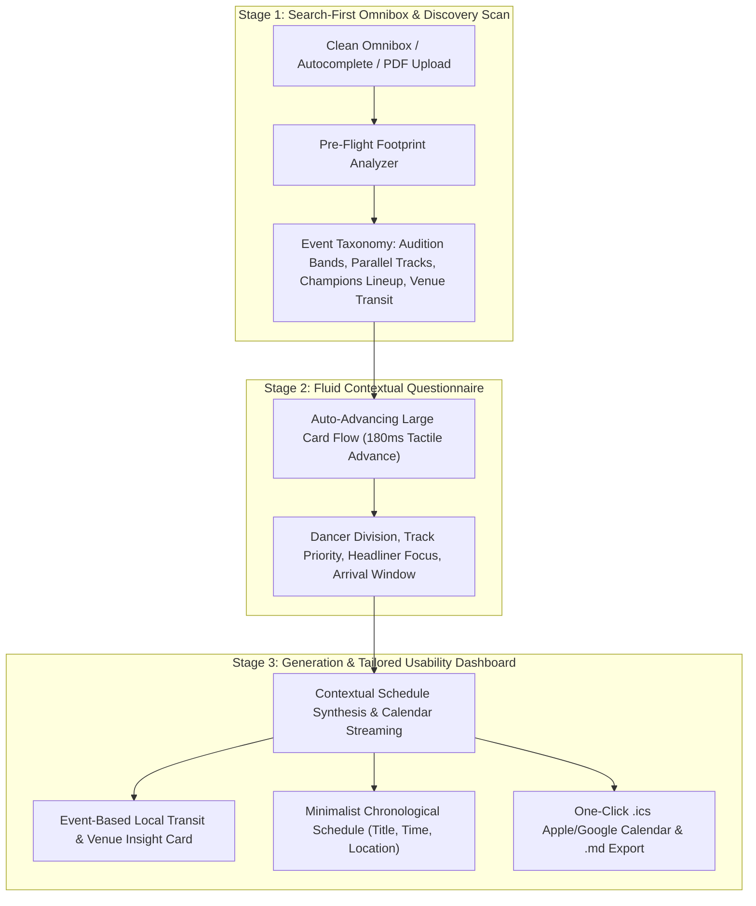

# WCS Navigator: Comprehensive System Requirements & Technical Specification

**Project:** WCS Navigator (West Coast Swing Event Schedule & Travel Optimizer)  
**System Scope:** Standalone Intelligent Two-Pass Agentic Scheduling Service  
**Architecture:** React 19 Frontend + FastAPI Backend (Google Cloud Run / Gemini Flash)  
**Decoupling Notice:** This specification is strictly dedicated to WCS Navigator and operates independently of any external scraping systems.

---

## 🎯 1. System Overview & Architecture

WCS Navigator automates the planning of multi-track dance conventions through an intelligent two-pass workflow:

---

## 📋 2. Functional Requirements (FR)

### FR-1: Search-First Landing Experience
- **FR-1.1 (Clean Omnibox)**: Provide a single, centered search bar with instant autocomplete across California 2026 events.
- **FR-1.2 (Header Controls & Sub-Footer)**: Minimalist top row with logo, How It Works guide, and Presets jump; clean sub-footer branding.
- **FR-1.3 (Collapsible Custom Upload)**: Hidden accordion drawer for custom PDF/URL timetable uploads.

### FR-2: Pre-Flight Event Footprint Analysis (`analyzeEventFootprint`)
- **FR-2.1 (Taxonomy Discovery)**: Analyze the timetable payload dynamically before rendering questions.
- **FR-2.2 (Audition Tiers & Persona)**: Query audition tier eligibility (e.g. *Boogie Level 4/5* vs *US Open* vs *South Bay*).
- **FR-2.3 (Parallel Workshop Streams)**: Isolate the event's actual class themes (e.g. *Footwork & Connection*, *Musicality & Phrasing*, *Dips & Flow*).
- **FR-2.4 (Featured Champions Query)**: Dynamically query headlining staff scheduled for that weekend (e.g. *Benji Schwimmer*, *Jordan & Tatiana*, *Kyle & Sarah*).
- **FR-2.5 (Venue-Specific Friday Arrival)**: Query flight touchdown target tailored to host hotel transit.

### FR-3: Fluid Auto-Advancing Card Questionnaire
- **FR-3.1 (Large Selection Cards)**: Single-column centered layout (`max-w-xl mx-auto`) with distinct emoji badges, bold titles, and concise descriptions.
- **FR-3.2 (Frictionless Auto-Advance)**: Auto-advance to the next question after 180ms upon card selection.
- **FR-3.3 (Tactile Back Navigation)**: Sleek top-left `← Back` button.

### FR-4: Event-Based Local Transit & Venue Logistics
- **FR-4.1 (Actionable Venue Tips)**: Real host hotel logistics (e.g. *SFO 5-min Hyatt shuttle*, *SJC 7-min transfer*, early bell desk bag check, ballroom access).
- **FR-4.2 (Zero Imaginary Math)**: Replace arbitrary countdown arithmetic with verified local transit and dancer amenities.

### FR-5: Minimalist Chronological Schedule & Calendar Streaming
- **FR-5.1 (Decluttered Session Cards)**: Display clean Title, Time (`Clock`), and Ballroom Location (`MapPin`).
- **FR-5.2 (No Robot Text Blocks)**: Eliminate explanatory AI rationale boxes and redundant authenticity badges.
- **FR-5.3 (One-Click Calendar Stream)**: Stream RFC 5545 `.ics` files ready for Apple Calendar, Google Calendar, and Outlook.
