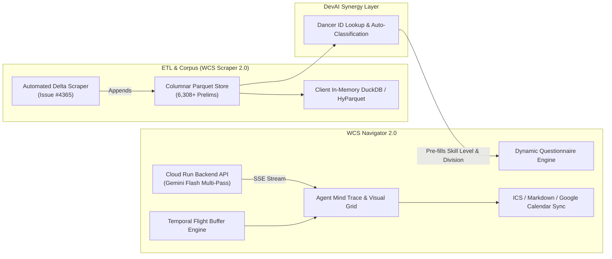

# WCS Scraper & WCS Navigator: Next-Generation Plan & Requirements

**Status:** Architecture Blueprint & Next-Phase Execution Plan  
**Target Milestone:** WCS Suite 2.0 / DevAI Live Experiments Integration  
**Dependencies:** Consolidated Epic PR #4383, Gemini 3.5 / 2.5 Flash GenAI SDK, Google Cloud Run

---

## 🎯 Executive Summary & Strategic Vision

With the consolidation of **Epic PR #4383**, the **WCS Scraper** and **WCS Navigator** have reached a unified, production-grade baseline:
1. **WCS Scraper** operates as a high-performance in-memory analytics engine with a 6,308-event indexed Parquet corpus, 300ms debounced search, active querying feedback, and dual-ID validation.
2. **WCS Navigator** provides an explainable 2-pass agent workflow with dynamic flight buffer calculus, interactive markdown export, and Cloud Run containerization.
3. **DevAI Live Experiments Hub** (`/devai`) serves as the active showcase uniting these autonomous perception and decision tools.

The next generation focuses on **deep cross-tool synergy**, **real-time live streaming integration**, **automated delta pipelines**, and **interactive calendar visualizations**.



---

## 🧭 WCS Navigator: Next-Phase Requirements

### 1. Live Cloud Run Backend Connection with Offline Golden Fallback
- **Requirement:** Connect the React frontend (`useNavigator.ts`) to the deployed Google Cloud Run backend (`https://wcs-navigator-api-*.run.app`) configured via `VITE_WCS_NAVIGATOR_API_URL`.
- **Resilience:** Maintain instant zero-latency golden fixture fallback for California 2026 presets (`Boogie by the Bay`, `Halloween SwingThing`, `Swingtacular`, `Wild Wild Westie`, `JJO`) when network is offline or backend API quota is exceeded.
- **Server-Sent Events (SSE) Streaming:** Implement progressive token streaming for the Agent Mind Trace so users see the step-by-step reasoning (`Extracting divisions` ➔ `Applying 60m buffer` ➔ `Filtering out-of-level workshops` ➔ `Building .ics`) in real time.

### 2. Cross-Tool Synergy: Dancer ID Auto-Classification
- **Requirement:** Add a "WSDC Dancer ID Quick Lookup" in `EventSearchHero` and `DynamicQuestionnaire`.
- **Integration:** When a dancer enters their Dancer ID (e.g. `1234`), Navigator queries the local Scraper Parquet dataset:
  - Automatically identifies their highest competed division (e.g. Intermediate vs Advanced).
  - Pre-selects relevant competition sessions in the dynamic questionnaire.
  - Automatically filters level-restricted workshops (e.g. Advanced-only intensives).

### 3. Interactive Multi-Day Visual Timeline Grid
- **Requirement:** Complement the list-based `FilteringAuditMatrix` with an interactive, responsive multi-track schedule grid (Friday / Saturday / Sunday).
- **Features:**
  - Color-coded badges for Workshops (Cyan), Competitions (Emerald), Social Dancing (Purple), and Buffer Windows (Amber).
  - Toggle between "My Optimized Track" and "Full Event Schedule".
  - One-click Google Calendar / Apple Calendar subscription link (Webcal URL).

### 4. Arbitrary PDF Upload & Vision Extraction
- **Requirement:** Complete the end-to-end user upload flow in `DropzoneUpload.tsx`.
- **Backend Flow:** Upload arbitrary weekend schedule PDF bytes directly to `POST /api/v1/discover` using Gemini Flash multimodal document processing.

### 5. Backend Unit Testing & Contract Verification
- **Issue Reference:** Address **Issue #4360** (`test(api): add unit tests for pdf_service and buffer_engine in wcs_navigator_api`).
- **Coverage:** Unit tests for `buffer_engine.py` (temporal calculations, timezone transitions) and `pdf_service.py` mock responses.

---

## 📊 WCS Scraper: Next-Phase Requirements

### 1. Incremental Automated Delta Ingestion (Issue #4365 & #4363)
- **Requirement:** Refactor `etl/scraper.py` from monolithic re-scrapes to incremental delta ingestion.
- **Batch Updates:** Fetch new event prelims links and append to `etl/data/wcs_prelims.parquet` using PyArrow dataset partitioning.
- **Scheduled GitHub Action:** Configure a weekly cron workflow (`.github/workflows/wcs-data-sync.yml`) that runs headless extraction, runs integrity assertions, and submits an automated PR with freshly verified Parquet artifacts.

### 2. Competitor Deep-Dive & Progression Analytics
- **Requirement:** Enable clickable competitor rows in `WCSDataTable.tsx`.
- **Modal / Detail View:**
  - Historical points breakdown by event and year.
  - Placement trend visualization (1st / 2nd / 3rd / Finalist distribution).
  - WSDC Tier Advancement Bar: visual progress towards the next division tier (e.g., `12 / 16 points to Advanced`).

### 3. Client-Side Column Filtering & Custom Range Queries
- **Requirement:** Support multi-parameter client-side queries:
  - Filter by Event Year / Date Range (2023 - 2026).
  - Filter by Division Tier (Novice, Intermediate, Advanced, All-Star, Champions).
  - Filter by Role (Lead, Follow).

---

## 🛠️ Updated Documentation Architecture

| Document Path | Purpose & Scope |
| :--- | :--- |
| [`wcs_scraper_navigator_next_gen_roadmap.md`](file:///home/ari/.gemini/antigravity-cli/brain/96944a59-687f-4e64-9de1-7569e28fd475/wcs_scraper_navigator_next_gen_roadmap.md) | Canonical roadmap, system architecture, and milestone specification. |
| [`docs/api/wcs-navigator-api.md`](file:///home/ari/tech-dancer/docs/api/wcs-navigator-api.md) | FastAPI endpoint contracts, Pydantic schemas, and Cloud Run deployment protocol. |
| [`docs/data/wcs-scraper-spec.md`](file:///home/ari/tech-dancer/docs/data/wcs-scraper-spec.md) | Parquet schema definition, DuckDB query patterns, and dual-ID validation rules. |
| [`content/studies/wcs-scraper-initial-sync.md`](file:///home/ari/tech-dancer/content/studies/wcs-scraper-initial-sync.md) | Technical case study documenting the ETL pipeline, Parquet optimization, and DevAI integration. |

---

## 🗓️ Implementation Phases & Milestone Schedule

```
Phase 1: Backend Testing & API Gateway Scaffolding
├── [Issue #4360] Unit test coverage for buffer_engine.py & pdf_service.py
└── Configure VITE_WCS_NAVIGATOR_API_URL environment injection

Phase 2: Scraper Incremental ETL & Delta Automation
├── [Issue #4365 / #4363] Optimize results link fetching & batch Parquet append
└── Set up automated weekly GitHub Action refresh workflow

Phase 3: Cross-Tool Synergy (Scraper ➔ Navigator Integration)
├── Implement Dancer ID lookup hook in frontend (useDancerProfile)
└── Auto-populate division tiers and tailored workshop recommendations in Navigator

Phase 4: Advanced UI & Streaming Experience
├── Interactive multi-track schedule grid (Visual Day/Hour Timeline)
└── SSE streaming integration for Agent Mind Trace
```
