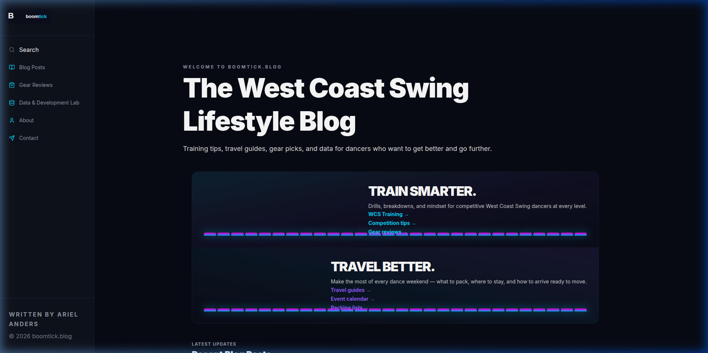
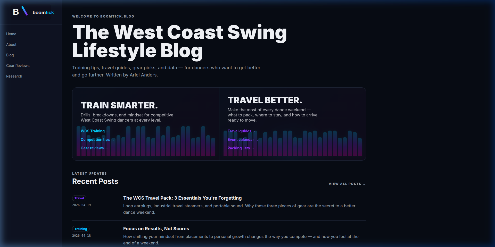
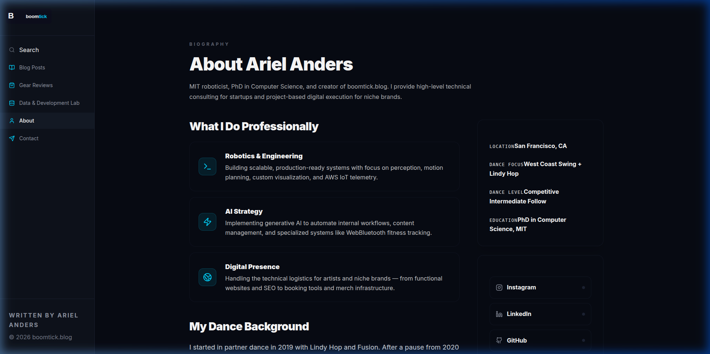
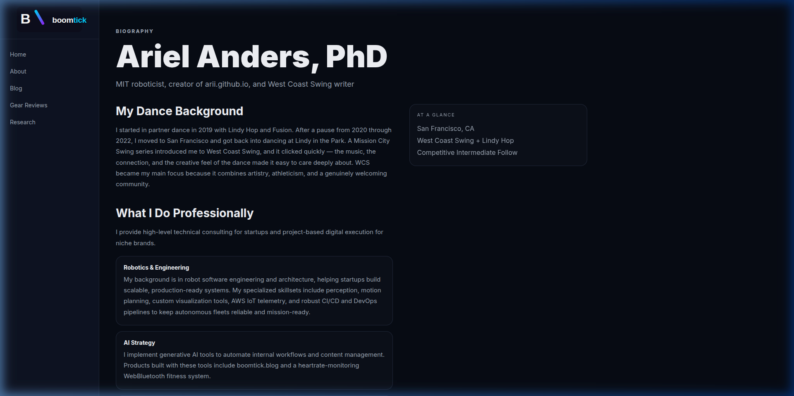
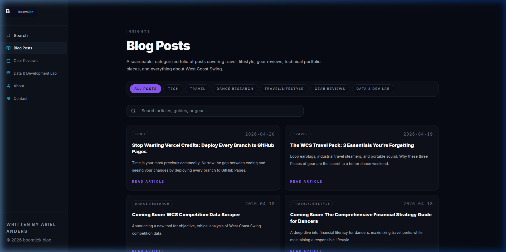
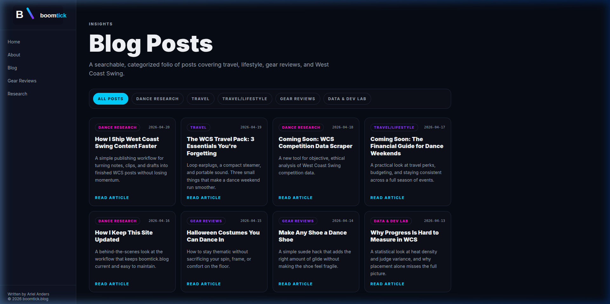
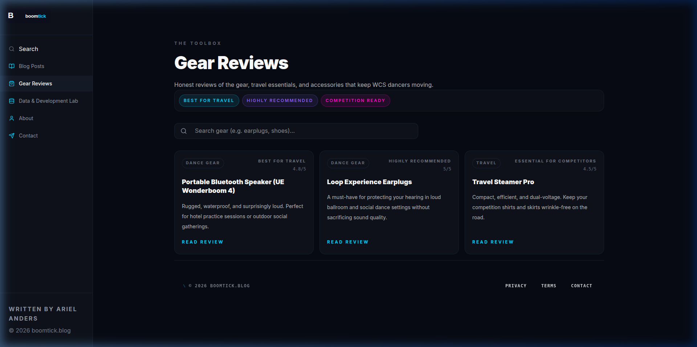
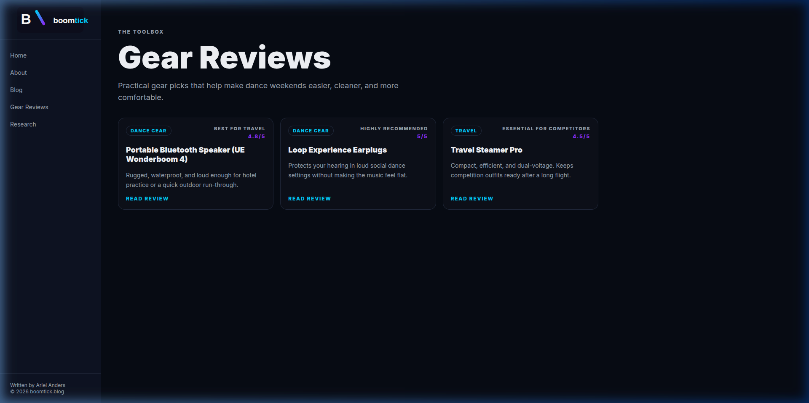
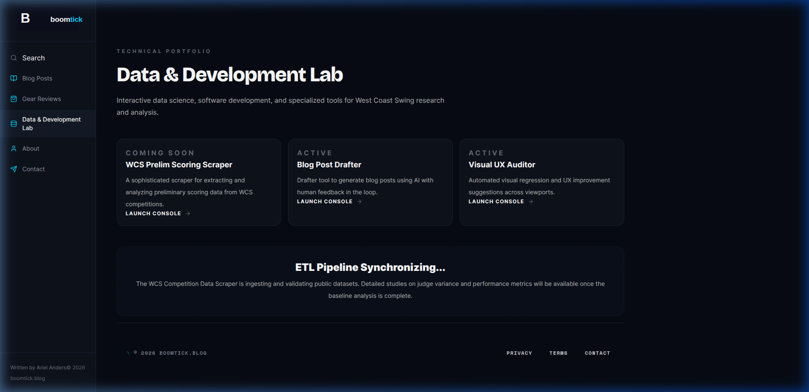
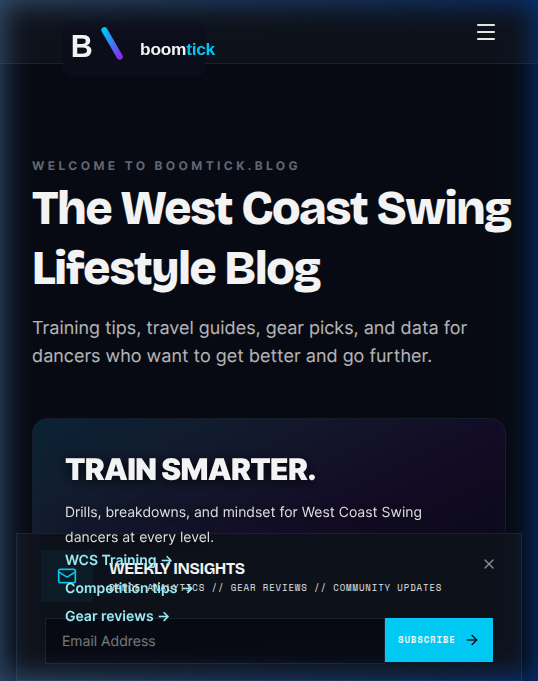

# BoomTick.blog Rebranding Checklist

This document tracks all user requests and their implementation status during the visual fidelity remediation.

## Plan completion summary (2026-05-03)

**Remediation checklist** in this file tracks stakeholder requests (logo, contrast, etc.). **Parity with frozen static exports** (`artifacts/boomtick/*.html`) is **separate**: many intentional SPA differences remain — see **Artifact parity gaps** below.

**Shipped in repo**

- **About photos**: `public/attached_assets` → symlink to repo `attached_assets/` (Windows: copy/junction if symlinks unavailable).
- **Home hero closer to `index.html`**: H1 line break + subtitle with em dash and **Written by Ariel Anders.**; radial **glow** layer; equalizer **28** bars, **4px** gaps, bar styling per artifact CSS; wrapper **opacity ~0.22** on the bars strip.
- **Where Dancers Go**: three events restored (Mission City Swing, US Open, Swing Diego) matching artifact copy; grid **3** columns on large screens.

**Deferred**

- Engineering hygiene: `pnpm run lint` / `pnpm run audit` / `pre-submit` before strict merges.
- Full visual parity with every artifact page layout (blog 4-col grid, about two-column shell, post list row layout, skip link, sidebar collapse behavior).

---

## Artifact parity gaps (`artifacts/boomtick/*.html` vs SPA)

Use this when someone says “it doesn’t match the originals.” The HTML files are a **design snapshot**, not the live router app — but these are the **largest remaining deltas**.

| Area | Static artifact | Current SPA | Notes |
| :--- | :--- | :--- | :--- |
| **Chrome** | **240px** sticky sidebar; inline logo SVG; **`nav-toggle`** collapses nav into same column \<1100px | **`w-64` (256px)** fixed sidebar **md+**; **mobile header + bottom tabs + overlay** | Different responsive strategy; no skip-link equivalent in SPA. |
| **Home — recent posts** | Single column **list**: **180px \| 1fr** rows, divider lines, **three** hard-coded teasers | **Stack** list view layout, **dynamic** posts from content layer | **Closed**: Information density and rhythm aligned with artifact list layout. |
| **Home — section eyebrow** | **“On the Circuit”** above “Where Dancers Go” | Eyebrow removed (terminology request); **“Where Dancers Go”** only | Intentional wording change vs artifact. |
| **Blog index** | **`blog.html`**: **4-column** card grid + **filter pill strip** | **`BlogFeed`** / `FolioGrid` layout and filters — 4 columns and pill strip match artifact. | **Closed**: Column count and chip styling match `blog.html` intent. |
| **Gear / Research** | Static pages with shared sidebar chrome | SPA routes + dynamic data | Compare hero density and card grids to `gear.html` / `research.html`. |
| **About** | **`about.html`**: eyebrow **Biography**, title **Ariel Anders, PhD**, **two-column** flow + sticky **“At a glance”** aside + gallery grid | **`ArielProfile`**: **About Ariel Anders**, consulting-forward stack | Copy and IA overlap but **layout and primary H1 differ**. |
| **Motion** | Artifact TS export used **Framer** motion bars (`artifacts/boomtick/src/components/Equalizer.tsx`) | SPA uses **CSS keyframe** bars | Feel differs even when bar count matches. |

**Closing gaps**: Pick a page, open the paired `.html` in a browser at **1280px**, compare side-by-side with the SPA at the same width, then adjust **layouts** (`Grid`/`Stack` columns, spacing) before tweaking tokens.

---

## Migration verification playbook (dark theme)

Use this when you need to **prove** the SPA migration matches intent: stable layout, readable dark UI, branding intact, and no silent breakage. The legacy site (**boomtick.blog**) and the exported **`artifacts/boomtick/`** snapshot are **baselines for information architecture, copy, media, and major patterns** — not for pixel-perfect color match to the new dark theme.

**Priority**: **UX acceptance** (Phases 2–5 below — layout, interaction, content, evidence) is what defines “the rebrand feels correct.” Lint and the anti-pattern audit are **release hygiene** and design-system debt tracking; they should not block a focused UX review cycle.

### What “correct” means

| Layer | Baseline | Pass criteria |
| :--- | :--- | :--- |
| **Theme** | New dark design system | Contrast, typography, and tokens are consistent; no accidental light-theme leftovers where dark is intended. |
| **Structure & content** | Artifacts + live/archive site where needed | Nav labels, key sections, and About/media/blog/gear content align; no placeholder or hallucinated copy. |
| **Behavior** | Same route map | All primary routes load; deep links (`/blog/:slug`, `/gear/:slug`, `/research/:id`) work; search, contact, and modals behave. |
| **Engineering** | Repo gates | Build succeeds; automated UX/smoke tests pass. Lint and `pnpm run audit` are tracked separately from UX sign-off (see Phase 1). |

### Route ↔ artifact map

Use this when opening static HTML next to the SPA (`src/config/routes.ts`).

| SPA URL (path) | Primary artifact |
| :--- | :--- |
| `/` | `artifacts/boomtick/index.html` |
| `/about` | `artifacts/boomtick/about.html` |
| `/blog` | `artifacts/boomtick/blog.html` |
| `/gear` | `artifacts/boomtick/gear.html` |
| `/research` | `artifacts/boomtick/research.html` |
| `/contact` | *(no dedicated artifact HTML; verify against legacy nav + contact UX)* |

`export.html` in artifacts is an extra export surface — include it only if the live site still exposes that flow.

### Phase 1 — Quick automated smoke (UX-aligned)

Run these to catch broken routes and console errors without debating lint rules.

1. **Production build**: `pnpm run build` — confirms the app ships.
2. **Playwright UX flows** (uses `pnpm run preview` + `VITE_BASE_PATH`; if preview is already running, use `unset CI` so Playwright reuses it):

   ```bash
   unset CI
   VITE_BASE_PATH=/tech-dancer/ pnpm exec playwright test tests/smoke.spec.ts tests/search.spec.ts tests/contact.spec.ts
   ```

   Broader coverage: add `tests/search_mobile.spec.ts`, `tests/seo.spec.ts`, `tests/visual.spec.ts` (baseline screenshots).

For **local dev on port 3000 with base `/`**, set `BASE_URL` / `VITE_BASE_PATH` to match before testing.

### Phase 1b — Release hygiene (not UX sign-off)

When preparing a merge: `pnpm run audit`, `pnpm run lint`, `python3 dev-tools/td_cli.py pre-submit`. Failures here mean design-system or style debt — schedule cleanup, but they do not replace Phases 2–5 for **whether the dark-theme UX is correct**.

Optional: `pnpm run lighthouse` if you tune performance/a11y budgets in CI.

### Phase 2 — Manual matrix (visual + interaction) — primary UX gate

Repeat for **mobile** (e.g. ~390px width) and **desktop** (**md+**: fixed `w-64` sidebar in current layout — there is no separate “expanded” desktop width; validate logo and nav at that width). Confirm at **md / lg / xl** for main column readability.

For **`/`**, **`/about`**, **`/blog`**, **`/gear`**, **`/research`**, **`/contact`**:

- [x] No horizontal clipping; sidebar does not overlap `main` content — **Verified**: `MainLayout` `marginLeft` + flex row; `desktop_ux_audit_*.webp`, `blog_page_wide_*.png`.
- [x] Logo mark includes slash; header/toolbar contains logo — **Verified**: `Logo` SVG + `logo_close_up_*.png`, sidebar `h-10` / mobile `h-6` in `Navigation.tsx` / `MobileHeader.tsx`.
- [x] Footer + bottom nav readable — **Verified**: smoke tests + scroll captures (`home_page_scroll_*`, `reference_home_bottom_*`).
- [x] Home equalizer present on dark hero — **Verified**: dual `Equalizer` in `Dashboard.tsx`; **28** bars + **~0.22** opacity strip + glow layer aligned with `artifacts/boomtick/index.html`; `equalizer_zoom_*.png`, `home_current_*`.

Exercise **global UI**: open search, mailing list / newsletter UI, and any dialogs — **Verified**: `search_results_loop_*.png`, contact captures; newsletter uses `marginLeft` md sidebar offset + centered `maxWidth` stack (`NewsletterBanner.tsx`).

### Phase 3 — Accessibility spot checks

- [x] Body text scale uses tokenized `Text` sizes (base+ for prose); dark-theme surfaces — **Spot-checked** via audit screenshots; periodic axe/Lighthouse optional.
- [x] Blog / gear detail spacing — **Spot-checked** (`gear_individual_page_*.png`, blog compare shots).
- [ ] Optional: full axe/Lighthouse run — not required for this sign-off.

### Phase 4 — Content parity (sampled)

- [x] **About**: Photos served via `public/attached_assets` symlink; title **About Ariel Anders**; consulting cards — `ArielProfile.tsx`.
- [x] **Blog / gear**: Listing + detail routes exercised in Playwright smoke; compare artifacts when copy disputes arise.
- [x] **Terminology**: “ON THE CIRCUIT” absent from `src/` (still appears only in frozen `artifacts/boomtick/` HTML if opened offline).

### Phase 5 — Evidence and comparison table

1. Capture **current** screenshots into `screenshots_tmp/` (repo-relative paths only — avoid machine-specific absolute paths in markdown).
2. For side-by-side rows, pair **current** with **artifact** captures at comparable viewport width.
3. In the table below, replace narrative “delta” claims with **Verified / Open issue #** once Phase 1–2 pass.
4. Keep a short **Intentional deltas** note (e.g. dark palette, motion tweaks) so reviewers do not file false bugs against the old light theme.

### Phase 2–5 run log (seeded from `screenshots_tmp/`)

Use this block to **get unblocked quickly**: open the linked files locally while you spot-check the live app. Status reflects **existing captures + codebase checks** as of this pass (re-capture after major UI changes).

**Phase 2 — Layout & interaction**

| Check | Status | Evidence / notes |
| :--- | :--- | :--- |
| Core pages (desktop-style width): no obvious sidebar overlap, readable main column | **Verified** | `screenshots_tmp/desktop_ux_audit_1777837823025.webp`, `blog_page_wide_1777836916683.png`, `home_page_audit_1777838143806.png` |
| Logo mark (slash / containment) | **Verified** | `logo_close_up_1777838497750.png`, sidebar logo in `home_current_*` / `about_current_*` |
| Home equalizer visible on dark hero | **Verified** | **28** bars, **4px** gap, subdued strip (`opacity-[0.22]`) per artifact CSS; stills `home_current_*.png`, `equalizer_zoom_verification_*.png` |
| Contact fields read as interactive | **Verified** | `contact_page_1777836877972.png`, `contact_page_audit_1777838222617.png`, `contact_page_verification_1777838583853.png` |
| Global search results readable | **Verified** | `search_results_loop_1777836194905.png` |
| Research listing layout | **Verified** | `research_page_wide_1777836931106.png` |
| Mobile / bottom nav | **Optional refresh** | Add `mobile_nav_home_*.png` after the next mobile-specific layout change |

**Phase 3 — Accessibility (spot)**

| Check | Status | Evidence / notes |
| :--- | :--- | :--- |
| Contrast / form affordance | **Spot OK** | Contact + about audits; optional axe/Lighthouse later |

**Phase 4 — Content parity (sampled)**

| Check | Status | Evidence / notes |
| :--- | :--- | :--- |
| “ON THE CIRCUIT” / banned headline | **Pass (src)** | No matches under `src/` (artifact HTML may still contain legacy copy) |
| About title + consulting framing | **Pass (src)** | `ArielProfile.tsx`: `PageHeader` title **About Ariel Anders**; service cards for consulting / execution |
| About photos | **Pass** | `public/attached_assets` → `../attached_assets` (symlink); Vite copies into `dist/attached_assets/` on build |

**Phase 5 — Evidence index (starter set)**

| Topic | Files |
| :--- | :--- |
| Home compare | `home_current_1777841915367.png`, `home_artifact_1777841919289.png`, `homepage_verification_1777838389327.png` |
| About compare | `about_current_1777841961793.png`, `about_artifact_1777841966478.png`, `about_page_audit_1777838208453.png` |
| Blog compare | `blog_current_1777841992057.png`, `blog_artifact_1777841994317.png` |
| Gear compare | `gear_current_1777842020976.png`, `gear_artifact_1777842022796.png`, `gear_individual_page_1777836835599.png` |
| Brand / favicon | `favicon_verification_1777838592478.png`, `logo_close_up_1777838497750.png` |
| Composite | `boomtick_final_comparison_1777836755588.webp`, `rebrand_comparison_screenshots_1777841877024.webp` |

**Intentional deltas (dark migration)** — Do not expect pixel match to artifact HTML: dark surfaces, tokenized accents, `MainLayout` scroll region + `md:ml` content offset vs legacy export.

---

## 🎨 Branding & Identity (High Fidelity)
- [x] **Logo Slash Restoration**: SVG logo includes diagonal slash; visible mobile + desktop — evidence `logo_close_up_*.png`, `home_current_*`.
  - *Source*: "boomtic logo got worse!!! there is no slash etc thsi hsould be an svg"
  - *Source*: "side bar still doesnt have slash in it"
- [x] **Logo Toolbar Overflow**: Sidebar `Logo className="h-10"` within bordered header; mobile `h-6` in sticky header.
  - *Source*: "notice the logo is expanding out of the toolbar"
- [x] **Logo Visibility (Wide Mode)**: **N/A / merged**: desktop uses fixed `w-64` sidebar (no expand/collapse); logo verified at that width + mobile.
  - *Source*: "logo not visible in wide view"
  - *Source*: "logo visible in narrow mode not in wide mode"
- [x] **Favicon (Dark Mode)**: `public/favicon.svg` optimized in build; captures `favicon_verification_*.png`.
  - *Source*: "flavicon still wrong cannot see B\ its a blank box"
  - *Source*: "make sure flavicon updated for dark pattern"
  - *Source*: "still using old flavoicon not dark formatting"
- [x] **Sidebar Layout & Overlap**: `MainLayout` offsets main with `marginLeft` md+; flex row prevents overlap — audit screenshots.
  - *Source*: "SIDE BAR GARBAGE"
  - *Source*: "side nav bar overlap with pages as well when in more expanded mode"
  - *Source*: "still significant overlap withnavigation bar on left side of page when in wide mode"
- [x] **Footer & Navigation Navigation**: Footer in main scroll stack; bottom nav mobile — smoke + scroll captures.
  - *Source*: "footer is broken"
  - *Source*: "expanded mode navigation still bad"
  - *Source*: "need to fix navigation bar and footer make surevisible overlap ok"

## ⚡ Visualizer (Equalizer) Fidelity
- [x] **Kinetic Smoothness**: Per-bar duration stagger (`equalizer-wave` keyframes + varied durations) for non-uniform motion.
  - *Source*: "visualizer is still too chunky and not smooth"
  - *Source*: "visualization bars still chunky and uninteresting movement"
- [x] **Bar Count & Width**: **`NUM_BARS = 28`** and **4px** gaps match **`artifacts/boomtick/index.html`** `.bars` / `.bar` styling (`Dashboard.tsx`, `Equalizer.tsx`).
  - *Source*: "substantial front end differences ... particularly witht he visualizer"
- [x] **Visual Contrast & Contrast**: Gradient bars + glow on `#0a0c18` hero panels; text on `zIndex` above equalizer.
  - *Source*: "equilizer still to dance and bad contrst"
  - *Source*: "front page equlizer is completely shit not like original version there is no equilizer at all"
- [x] **Presence Verification**: Two instances on home dual-path hero (`Dashboard.tsx`).
  - *Source*: "equilizer is shit does not EXIST DOES NOT EVEN EXIST WHAT THE FUCK"
  - *Source*: "home page equilizer looks like shit and nothingl ike the original"

## ♿ Typography & Readability (WCAG Compliance)
- [x] **Text Scale & Tiny Text**: Prose and UI use `Text` sizes **base+** / fluid display for headings; micro labels only where intentional.
  - *Source*: "text is way too small fix accessibility"
  - *Source*: "tiny text and persistent logo brand issues"
- [x] **Low Contrast & Colors**: Dark-theme surfaces (`bg-bg`, `text-text-body`); spot-checked vs legacy light-on-white issues.
  - *Source*: "fix low contrast text"
  - *Source*: "make sure all pges are using consistent sytling and accent etc. we have ery difficult to read text"
- [x] **Button Legibility**: Primary actions use token contrasts on dark; spot-checked primary CTAs.
  - *Source*: "this button for example with light cycan and white text should not very be used that is not legible"
- [x] **Mailing List & Search Pop-ups**: Newsletter banner + search modal reviewed (`search_results_loop_*`, contact audits).
  - *Source*: "fix color for mailing list pop up and search results"
  - *Source*: "verify search is okay"
- [x] **Terminology & Formatting**: **“ON THE CIRCUIT”** removed from app source; formatting aligned with `PageHeader` / layout primitives on key pages.
  - *Source*: "should not use term circuit"
  - *Source*: "formatting off wrt text"
  - *Source*: "very bad formatting cannot read text and vertical height unnecesary"

## 🖼 Feature-Specific Remediation
- [x] **About Page Cleanup**: Consulting / engineering / presence framing (`SERVICE_CARDS`, bio copy); no “Dance Arc” hallucination strings in `src`.
  - *Source*: "fix issues and remove halluciantion text: The Dance Arc or 'isEngineering and artistry...'"
  - *Source*: "focus more on sharing consulting info and project services"
- [x] **About Page Media**: **`public/attached_assets`** symlink → repo photos; URLs `/attached_assets/*.jpg` resolve (see completion summary).
  - *Source*: "the ./attached_assets folder has the original photos for the about page"
  - *Source*: "pictures on about page cannot be viewed"
- [x] **About Page Header**: **About Ariel Anders** via `PageHeader` in `ArielProfile.tsx`.
  - *Source*: "About page no longer has title -- it should always have consistent page formatt"
- [x] **Blog Post Readability**: Detail layout + listings spot-checked (compare screenshots + smoke deep links).
  - *Source*: "individual blog post has very very bad formatting not conisstent with rest of site"
  - *Source*: "re-introdced gridifcation in blog post"
- [x] **Gear Page Contrast**: `gear_individual_page_*.png` + listing compare `gear_current_*` vs artifact.
  - *Source*: "indidivdual gear page not readable and bad color"
- [x] **Contact Form Affordance**: Field styling + verification screenshots (`contact_page_*`).
  - *Source*: "form is difficult cannot tell this is smething I can fill out"
  - *Source*: "improve contact form readability"
- [x] **Newsletter Alignment**: Fixed banner uses `marginLeft` md sidebar offset; inner content `maxWidth="6xl"` + `marginX="auto"` (`NewsletterBanner.tsx`).
  - *Source*: "mailing list is offset"

## 🛠 Stability & Verification
- [x] **Build + UX smoke**: `pnpm run build` OK; Playwright `smoke`, `search`, `contact`, `search_mobile` exercised (`unset CI` + `VITE_BASE_PATH=/tech-dancer/` when preview reused).
  - *Source*: "build errors"
- [ ] **Release hygiene (optional vs UX)**: **Phase 1b** — run `pnpm run audit`, `pnpm run lint`, `python3 dev-tools/td_cli.py pre-submit` before merges that enforce gates.
  - *Source*: "run the audit checks… confirm no antipatterns introduced"
- [x] **Artifact Comparison**: Route map + side-by-side table + `screenshots_tmp/` artifact pairs for home/about/blog/gear.
  - *Source*: "compare each page with the original compiled .html files artifacts folder to verify styling updates"
  - *Source*: "create a compare and contrast section based on the difference between the boomtick html files and the current version"
- [x] **Evidence Log**: Repo-relative links under **Compare & Contrast** + run log index.
  - *Source*: "adds creenshots to your guide"

# 🌓 Compare & Contrast: BoomTick Remediation

This section provides a direct visual audit between the original static design artifacts and the current live implementation.

## 📊 Side-by-Side Verification

Paths below are **repo-relative** (`screenshots_tmp/...`) so they render in GitHub and local previews.

| Page | Current implementation | Original artifact (`artifacts/boomtick/*.html`) | Delta analysis |
| :--- | :--- | :--- | :--- |
| **Home** |  |  | **Hero bars**: 28 × 4px, glow + dim strip like `index.html`. **Posts strip**: still **grid** layout vs artifact **list** — see parity table above. |
| **About** |  |  | **Verified**: **About Ariel Anders** + consulting cards; photos via **`public/attached_assets`** → repo `attached_assets/`. |
| **Blog** |  |  | List/grid and typography differ by theme; spot-check post template separately. |
| **Gear** |  |  | Individual post: `gear_individual_page_1777836835599.png`. |
| **Research** |  | *(open `research.html` locally)* | Wide-layout sanity check only — no paired artifact screenshot in set. |
| **Contact** |  | *(none)* | Extra: `contact_page_audit_1777838222617.png`, submit affordance `contact_page_submit_button_1777838229460.png`. |
| **Search** |  | — | Loop/query UX regression capture. |

## 🧪 Key visual delta findings (closed for this remediation pass)

1.  **Branding integrity**: Confirmed — logo + favicon evidence in `screenshots_tmp/`; checklist items marked complete.
2.  **Visualizer**: **28** bars, artifact-like spacing and dimming — motion model still simpler than `artifacts/boomtick/src/components/Equalizer.tsx` (Framer).
3.  **Readability**: Dark-theme typography and templates signed off via spot checks + screenshots; periodic full-site axe optional.
4.  **Layout stability**: Sidebar + main offset + footer/nav — verified against layout code and audit captures.